# Webpack

## --save-dev 与 --save 区别

表面上的区别是`--save`会把依赖包名称添加到 package.json 文件 `dependencies` 键下，`--save-dev` 则添加到 package.json 文件 `devDependencies` 键下。
它们真正的区别是，npm自己的文档说`dependencies是运行时依赖`，`devDependencies是开发时的依赖`。即`devDependencies` 下列出的模块，是我们`开发时用的`，比如 我们安装 js的压缩包gulp-uglify 时，我们采用的是 “npm install –save-dev gulp-uglify ”命令安装，因为我们在发布后用不到它，而只是在我们开发才用到它。`dependencies` 下的模块，则是我们`发布后还需要依赖的模块`，譬如像`jQuery`库或者`Vue`框架类似的，我们在开发完后后肯定还要依赖它们，否则就运行不了。

另外需要补充的是： 正常使用`npm install`时，会下载`dependencies和devDependencies`中的模块，当使用`npm install –production`或者注明N`ODE_ENV变量值为production时`，只会下载`dependencies`中的模块。

## webpack 介绍

### webpack 的诞生

> I'ts funny story how I started with Webpack. Before getting addicted to JavaScript, I also developed in Java. I tried GWT(Google Web Toolkit) in that time. GWT is a Java-toJavaScript Compiler, which has a great feature: code-splitting. I liked this feature and missed it in existing JavaScript tooling. I made a pull reuqest to an existing moudle bundler, but it did not go through. Webpack was born.

- Tobias Koppers (github: @sokra)
- GWT (Google Web Toolkit) 代码分割
- Pull request
- Webpack
- Instagram团队维护

### 为什么需要构建

1. 开发分工变化
  + 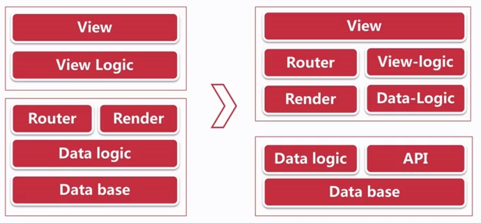
2. 框架的变化
  + 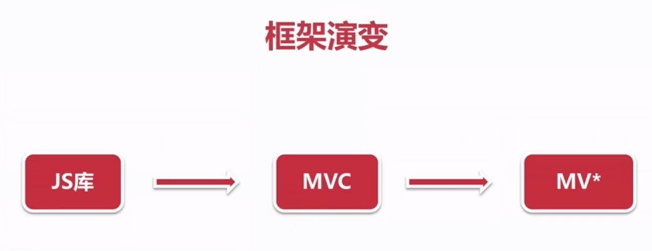
  + 
  + 
  + 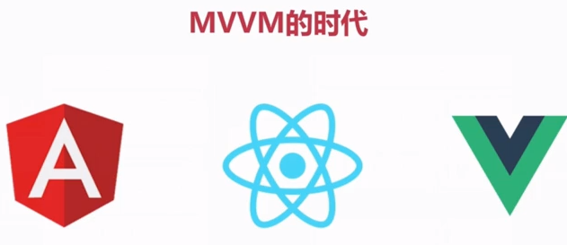
3. 语言的变化
  + 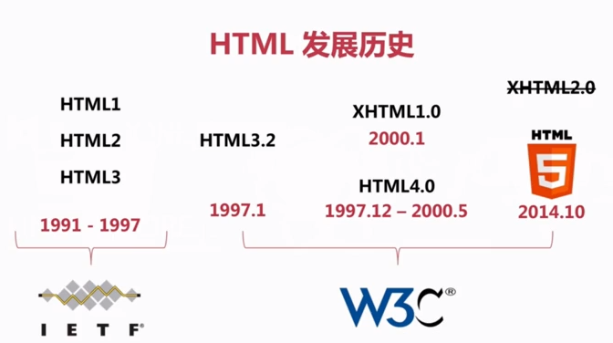
  + 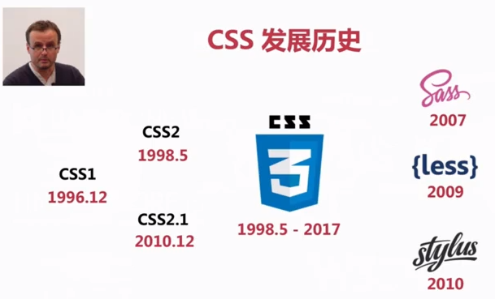
  + 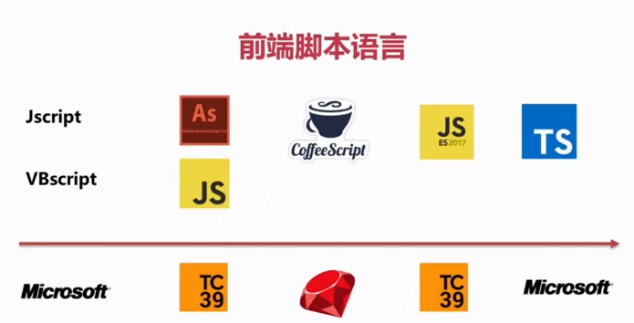
4. 环境的变化
  + 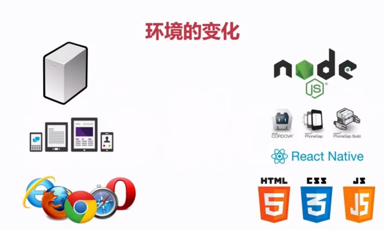
5. 社区的变化
  + Github
  + npm
6. 工具变化
  + 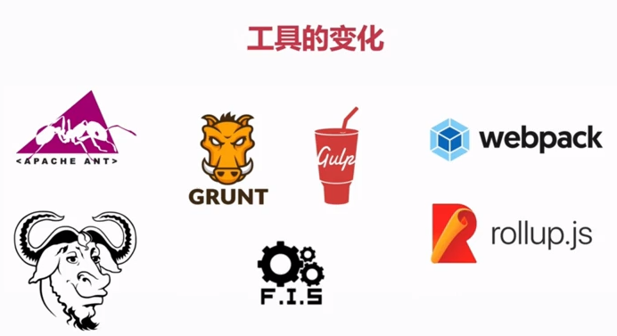

### 为什么前段需要构建

- 开发复杂化
- 框架去中心化
- 语言编译化
- 开发模块化

### 为什么 webpack

- 前段构建工具：Vue-cli / React-starter / Angular-cli 
- code-splitting 代码分割

### webpack 概述

> A bundler for javascript and friends. Packs many modules into a few bundled assets. Code Splitting allows to load parts for the paplication on demand. Through "loaers, " modules can be CommonJS, AMD, ES6 modules, CSS, Images, JSON, CoffeeScript, Less, .. and your custom stuff.

### webpack 版本变化

- v1.0.0 - 2014.2.20
  - 编译
  - 打包
  - HMR（模块热更新）
  - 代码分割
  - 文件处理(loader, plugin)
- v2.2.0 - 2017.1.18
  - Tree Shaking (仅打包需要的代码)
  - ES module
  - 动态 Import
  - 新的文档
- v3.0.0 - 2017.6.19
  - Scope Hoisting(作用域提升)
  - Magic Comments(配合动态import使用)
- v4.0.0 - ?

### 版本迁移

- v1 -> v2 
  - 迁移指南：https://webpack.js.org/guides/migrating/
  - 中文版：https://doc.webpack-china.org/guides/migrating/
- v2 -> v2

- 参与社区投票
  - [webpack vote](https://webpack.js.org/vote/)
  
## 内容概要

- 基于 Webpack 3.10+
- 前段整体工作流
- 前段工程化

### webpack

- 基础知识
  - 前段发展历史
  - 模块化开发
- 开发环境
  - 配置 SourceMap 调试
  - 配置远程接口代理
  - 配置动态 entry 更新
  - 配置模块热更新
  - 配置eslint检查代码格式
- 文件处理
  - 编译 ES6/7
  - 编译 TS
  - 编译 less/sass
  - postcss 处理浏览器前缀
  - css nano 压缩CSS
  - 自动生成HTML模板文件
  - 图片压缩和base64编码
  - 自动生成雪碧图
- 打包优化
  - 代码分割和懒加载
  - 提取公用代码
  - Tree-shaking
  - 长缓存配置
- 框架配合
  - vue-cli
  - angular-cli
  - react

## 模块化

- JS 模块化
  - 命名空间
    - 苦名.类别名.方法名
  - CommonJS(Node社区，Server)
  - AMD
  - CMD
  - UMD
  - ESM
    - EcmaScript Module 一个文件一个模块
    - export / import
- CSS 模块化
  - CSS 设计模式
    - 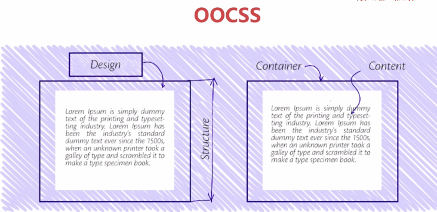 内容和容器分离
    - 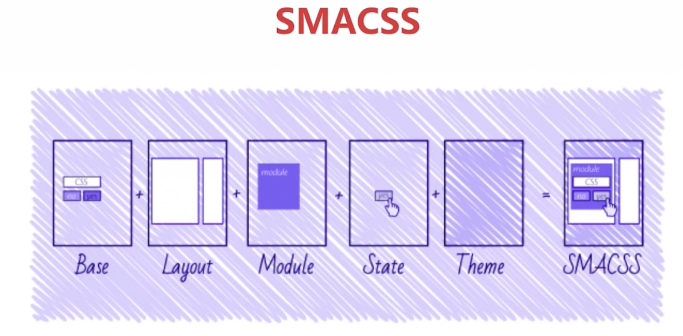 可扩展模块化结构
    - 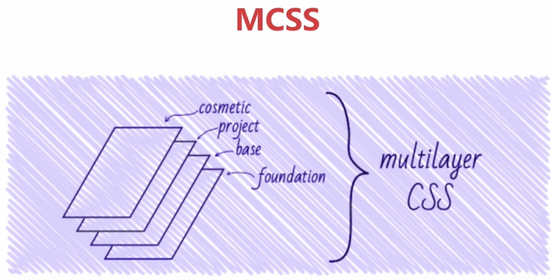
    - 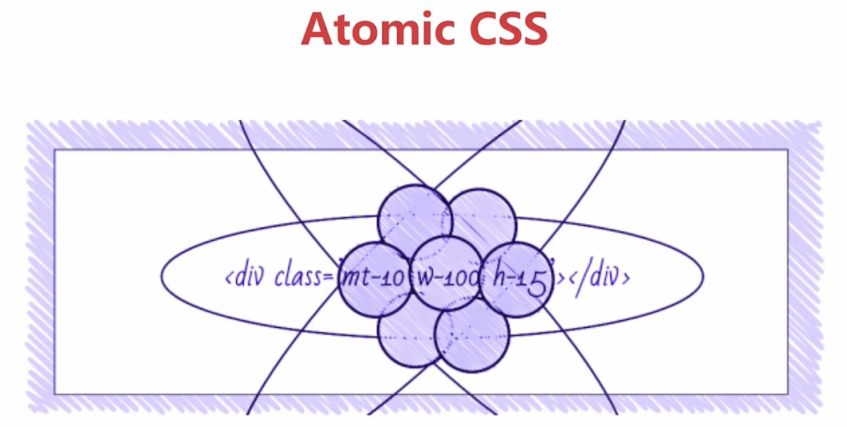
    - 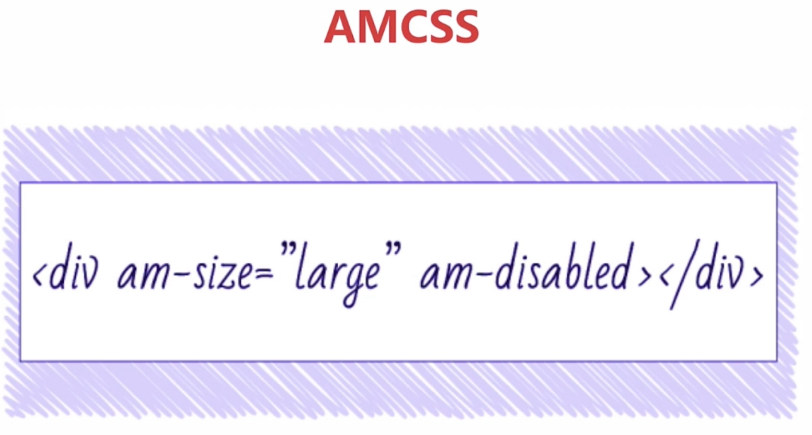
    - 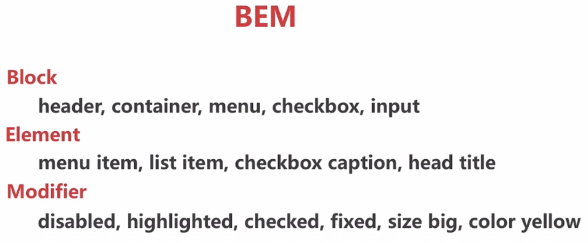
  - CSS Modules

### 环境准备

- 命令行工具
  - mac:
    - Terminal
    - [iTerm2](http://ww.iterm2.com)
    - [ohmyz](http://ohmyz.sh)
    - 知乎：mac 下有哪些好用的命令行工具
- node + npm
- webpack
  - `npm install webapck -g`
  - [权限错误解决方案](http://npm.github.io/installation-setup-docs/installing/a-note-on-permissions.html)

## webpack 核心概念

- Entry 打包入口
- Output 输出文件
- Loaders 其他资源文件处理
- Plugins 代码分割，压缩代码等

### Entry

- 代码的入口
- 打包的入口
- 单个或多个

``` js
module.exports = {
  entry: 'index.js'
}

module.exports = {
  entry: ['index.js', 'rendor.js']
}

module.exports = {
  entry: {
    index: ['index.js', 'app.js'],
    vendor: 'vendor.js'
  }
}
```

### Output

- 打包成的文件(bundle)
- 一个或多个
- 自定义规则
- 配合CDN

``` js
module.exports = {
  entry: 'index',
  output: {
    filename: 'index.min.js'
  }
}

module.exports = {
  entry: {
    index: 'index.js',
    vendor: 'vendor,js'
  },
  output: {
    filename: '[name].min.[hash:5].js'
  }
}
```

### Loaders

- 处理文件
- 转化为模块
- 常用 loader
  - 编译相关：babel-loader, ts-loader
  - 样式相关：style-loader, css-loader, less-loader, postcss-loader
  - 文件相关：file-loader, url-loader

``` js
module.exports = {
  module: {
    rules: [
      {
        test: /\.css$/,
        use: 'css-loader'
      }
    ]
  }
}
```

### Plugins

- 参与打包整个过程
- 打包优化和压缩
- 配置编译时的变量

- 常用 plugins
  - 优化相关
    - CommonsChunkPlugin 相同代码提取一个代码
    - UglifyjsWebpackPlugin 混淆压缩代码
  - 功能相关
    - ExtractTextWebpackPlugin css文件单独提取文件
    - HtmlWebpackPlugin
    - HotModuleReplacementPlugin 热莫名快热更新
    - CopyWebpackPlugin

- 名词
  - Chunk: 代码块
    - 两个页面使用相同的代码，提取一个Chunk
  - Bundle
  - Module

```js
const webpack = requrie('webpack')
module.exports = {
  plugins: [
    // js代码压缩
    new webpack.optimize.UglifyJsPlugin()
  ]
}
```

## 使用 webpack 方式

1. webpack 命令
2. webpack 配置
3. 第三方脚手架(vue-cli)

``` sh
$ webpack -h
$ webpack -v
$ webpack <entry> [<entry>] <output>
```

### webpack 配置

```sh
$ webpack
$ webpack --config webpack.config.js
```

### webpack-cli

- 交互式的初始化一个项目
- 迁移项目 v1->v2
- 不推荐使用

```sh
$ webapck-cli init webpack-addons-demo
```

### 打包JS

[打包JS源码](./bundle_js)

1. 命令打包

```sh
$ webpack app.js bundle.js
```
AMD 异步生成单独的 0.bundle.js

2. 配置文件打包

```sh
$ webpack --config webpack.conf.js
```

3. 配置文件打包 - webpack.conf.js 文件修改为 webpack.config.js

```sh
# webpack 自动查找webpacki.config.js 文件作为配置文件执行打包
$ webpack
```

## ES6 打包

### babel

> Babel是一个广泛使用的转码器，可以将ES6代码转为ES5代码，从而在现有环境执行。

``` js
// 转码前
input.map(item => item + 1)

// 转码后
input.map(function (item) {
  return item + 1;
});
```

- babel-loader
- babeljs.io

```sh
$ cd bundle_es6
$ npm init
$ npm i babel-loader@8.0.0-beta.0 @babel/core -D

或者不追求最新的babel
$ npm install --save-dev babel-loader babel-core

$ vim app.js
$ vim index.html
$ vim webpack.config.js
```

### babl-presets

- es2015
- es2016
- es2017
- env包括es2016-es2017和最新的latest
  - babel-preset-react
  - babel-preset-stage 0-3 没有正式发布的

```sh
与 $ npm i babel-loader@8.0.0-beta.0 @babel/core -D 匹配
$ npm i @babel/preset-env --save-dev

普通的babel-loader
$ npm i babel-preset-env --save-dev
```

起始preset是loader的参数

```js
use: {
  loader: 'babel-loader',
  options: {
    // 给babel-loader 指定presets
    presets: [
      '@babel/preset-env'
    ]
  }
}
```

`targets`选项可以设置哪些语法可以编译，哪些语法不想编译

- targets
- targets.browsers
  - targets.browers: "last 2 versions" 主流浏览器的最后两个版本支持
  - targets.browers: ">1%" 大于全球1%的浏览器支持
- browerslist 列表（数据来源于Can I use）
- Can I use

```js
presets: [
  ['@babel/preset-env', {
    targets: {
      browsers: ['> 1%', 'last 2 versions']
    }
  }]
]
```

### 配置 .babelrc

> Babel的配置文件`.babelrc`存放在**项目的根目录**下。使用Babel的第一步，就是配置这个文件。用来设置**转码规则**和**插件**

```json
{
  "presets": [],
  "plugins": []
}
```

presets字段设定转码规则，官方提供以下的规则集，你可以根据需要安装。

``` sh
# ES2015转码规则
$ npm install --save-dev babel-preset-es2015

# react转码规则
$ npm install --save-dev babel-preset-react

# ES7不同阶段语法提案的转码规则（共有4个阶段），选装一个
$ npm install --save-dev babel-preset-stage-0
$ npm install --save-dev babel-preset-stage-1
$ npm install --save-dev babel-preset-stage-2
$ npm install --save-dev babel-preset-stage-3
```

然后，将这些规则加入`.babelrc`

```json
{
  "presets": [
    "es2015",
    "react",
    "stage-2"
  ],
  "plugins": []
}
```

babel-preset：针对语法编译

函数和方法？babel-polyfill 和 babel-runtime-transform

### 函数和方法

- Generator
- Set
- Map
- Array.from
- Array.prototype.includes

- **Babel polyfill** 垫片（在各种浏览器保持同样的APi）
  - 全局垫片
  - 为应用准备，不是为框架准备
  - 使用方法
    - `npm install babel-polyfill --save`
    - `import "babel-polyfill"`
- **Babel Runtime Transform**
  - 局部垫片
  - 为开发框架准备
  - 使用方法
    - `npm i babel-plugin-transform-runtime --save-dev` 或者 `npm i @babel/plugin-transform-runtime --save-dev`
    - `npm i babel-runtime --save` 或者 `npm i @babel/runtime --save` 最新版本

``` sh
$ npm i babel-polyfill babel-runtime --save
$ npm i babel-plugin-transform-runtime --save-dev
$ vim app.js

  import 'babel-polyfill'

  let func = () => {}
  const NUM = 46
  let arr = [1,2,3]
  let arr2 = arr.map(item => item * 2)

  // 低版本浏览器不支持
  arr.includes(8)
  console.log('new Set(arr2)', new Set(arr2))

  function* func() {}

$ webpack
            Asset    Size  Chunks                    Chunk Names
  app.2efcebe9.js  291 kB       0  [emitted]  [big]  app
    [93] (webpack)/buildin/global.js 910 bytes {0} [built]
  [130] ./app.js 554 bytes {0} [built]
  [329] (webpack)/buildin/module.js 567 bytes {0} [built]
      + 330 hidden modules

  打包生成的文件比较大，因为文件中包含了polyfill（所有的polyfill都在全局作用域下）

```

使用runtime

``` sh
$ vim .babelrc
  {
    "presets": [
      ["@babel/preset-env", {
        "targets": {
          "browsers": ["> 1%", "last 2 versions"]
          //chrome: '52'
        }
      }]
    ],
    "plugins": ["transform-runtime"]
  }

注释options
$ vim webpack.config.js
  use: {
    loader: 'babel-loader',
    // options: {
    //   // 给babel-loader 指定presets
    //   presets: [
    //     ['@babel/preset-env', {
    //       targets: {
    //         browsers: ['> 1%', 'last 2 versions']
    //         //chrome: '52'
    //       }
    //     }]
    //   ]
    // }
  },

$ webpack

Module build failed: TypeError: this.setDynamic is not a function

$ cnpm i @babel/runtime --save
$ cnpm i @babel/plugin-transform-runtime --save-dev

$ vim .babelrc
  "plugins": ["@babel/transform-runtime"]
$ webpack
```

### 总结: polyfill和runtime

- 应用开发
  - `.babelrc` 配置 `presets`
  - ES6方法和函数 `import babel-polyfill`
- 开发UI组件库
  - ES6的新方法，使用runtime
  - 开发框架给第三方使用，不希望污染全局变量

## 编译 TypeScript

> JS的超集

- 官网： typescriptlang.org/tslang.cn
- Microsoft

### typescript-loader

- 安装
  - 官方：`npm i typescript ts-loader --save-dev`
  - 第三方：`npm i typescript awesome-typescript-loader --save-dev` 缓存机制

- 配置
  - `tsconfig.json`

- `webpack.config.js` 配置

- 配置选项: 官网/docs/handbook/compiler-options.html
- 常用选项：
  - `compilerOptions`
  - `include`
  - `exclude`

``` sh
$ mkdir bundle_ts && cd bundle_ts
$ npm init
$ vim tsconfig.json
  {
    "compilerOptions": {
      "module": "commonjs", // 包含ES6/7 和 commonjs
      "target": "es5", // ts 编译成 es5
      "allowJs": true, // js语法是否可以在ts文件中
    },
    
    "include": [ // 编译哪些目录文件
      "./src/*"
    ],
    
    "exclude": [ // 不编译哪些目录
      "./node_module"
    ]
  }
$ npm i webpack typescript ts-loader awesome-typescript-loader --save-dev
$ mkdir src
$ vim webpack.config.js
  module.exports = {
    entry: {
      app: './src/app.ts'
    },

    output: {
      filename: '[name].bundle.js'
    },

    module: {
      rules: [
        {
          test: /\.tsx?$/,
          use: {
            loader: 'ts-loader'
          }
        }
      ]
    }
  }

$ vim src/app.ts
  const num = 45
  interface Cat {
    name: String
    gender: String
  }
  function touchCat (cat: Cat) {
    console.log('miao~', cat.name)
  }
  touchCat({
    name: 'Tom',
    gender: 'male'
  })

$ webpack

ts中使用es函数
$ npm i lodash --save
$ vim app.ts
  import * as _ from 'lodash'
  console.log(_.chunk([1,2,3,4,5], 2))

```

`lodash`的所有函数都不会在原有的数据上进行操作，而是复制出一个新的数据而不改变原有数据。类似immutable.js的理念去处理。
`lodash`是一套工具库，内部封装了很多字符串、数组、对象等常见数据类型的处理函数

### 声明文件

```sh
$ npm i @types/loadash --save
$ npm i @types/vue --save
```

出错的时候声明文件及时的反馈错误信息

例如：
``` sh
$ vim app.ts
  console.log(_.chunk(2))

编辑之后没有任何信息反馈

安装
$ npm i @types/loadsh --save
$ webpack

提示编译错误: [tsl] ERROR in E:\lingyima\development\webpack_tutorial\bundle_ts\src\app.ts(3,21)
      TS2345: Argument of type '2' is not assignable to parameter of type 'ArrayLike<{}>'.
```

### Typings

全局安装 `npm i typings -g`

项目中：`typings install lodash`

``` sh
$ npm uninstall @types/lodash --save
$ npm i typings -g
$ typings i lodash --save

项目根目录生成 typings.json 文件和 typings目录

$ vim app.ts
  console.log(_.chunk(2))
$ webpack
  没有报错提示

$ vim tsconfig.json
  "compilerOptions": {
    "module": "commonjs",
    "target": "es5",
    "allowJs": true,
    "typeRoots": [
      "./node_modules/@type/",
      "./typings/modules"
    ]
  }
  ...
$ webpack
  提示类型错误

```

## 提取公共代码

- 减少代码冗余
- 提高加载速度

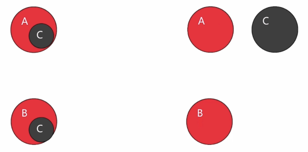

CommonsChunkPlugin 插件

webpack.optimize.CommonsChunkPlugin

### 配置

``` sh
$ vim webpack.config.js
  plugins: [
    new webpack.optimize.CommonsChunkPlugin(option)
  ]
```

- options
  - options.name or options.names
  - options.filename 公用代码打包之后的文件名
  - options.minChunks 数字的时候，最少是多少；自定义提取逻辑
  - options.chunks 提取代码范围
  - options.children
  - options.deepChildren
  - options.async 异步代码块

### 场景

- 单页应用
- 单页应用 + 第三方依赖
- 多页引用 + 第三方依赖 + webpack 生成代码

```sh
$ npm init

本地安装: 因为commonchunk是 webpack自带的，所以安装在本地。需要在配置文件中局部依赖， require依赖webpack。
$ npm i webpack --save-dev
$ mkdir src && cd src
$ touch page_a.js sub_page_a.js sub_page_b.js module_common.js

- page_a
  - sub_page_a
- sub_page_a
  - module_common
- sub_page_b
  - module_common

$ vim webpack.config.js
$ webpack

common.bundle.js webpack自己生成的代码
pageA.bundle.js 打包的文件代码
没有抽离出公用代码 common_bundle.js

如何抽离出来公共代码？ 单个entry 不会抽离公用代码

$ vim webpack.config.js

var webpack = require('webpack')
var path = require('path')

module.exports = {
  entry: {
    'pageA': './src/page_a',
    'pageB': './src/page_b'
  },

  output: {
    path: path.resolve(__dirname, './dist'),
    filename: '[name].bundle.js',
    chunkFilename: '[name].chunk.js'
  },

  plugins: [
    new webpack.optimize.CommonsChunkPlugin({
      name: 'common',
      minChunks: 2 // 重复模块大于等于2的全部抽出来
    })
  ]
}

$ webpack

common.bundle.js 包含了 module_common/sub_page_a/sub_page_b代码


安装第三方包并在page_a.js和page_b.js文件中引入lodash包 `import * as _ from 'lodash'`


$ npm i lodash --save

lodash和上面common.bundle.js打包在一起
$ vim webpack.config.js
var webpack = require('webpack')
var path = require('path')

module.exports = {
  entry: {
    'pageA': './src/page_a',
    'pageB': './src/page_b',
    'vendor': ['lodash']
  },

  output: {
    path: path.resolve(__dirname, './dist'),
    filename: '[name].bundle.js',
    chunkFilename: '[name].chunk.js'
  },

  plugins: [
    new webpack.optimize.CommonsChunkPlugin({
      name: 'vendor',
      minChunks: Infinity  // 不需要其他模块去查找公用代码
    })
  ]
}


pageB.bundle.js   1.5 kB       0  [emitted]         pageB
pageA.bundle.js  1.47 kB       1  [emitted]         pageA
vendor.bundle.js   546 kB       2  [emitted]  [big]  vendor

vendor.bundle.js 包含了 lodash 代码


第三方代码独立处理文件
$ vim webpack.config.js

var webpack = require('webpack')
var path = require('path')

module.exports = {
  entry: {
    'pageA': './src/page_a',
    'pageB': './src/page_b',
    'vendor': ['lodash']
  },

  output: {
    path: path.resolve(__dirname, './dist'),
    filename: '[name].bundle.js',
    chunkFilename: '[name].chunk.js'
  },

  plugins: [
    new webpack.optimize.CommonsChunkPlugin({
      name: 'vendor',
      minChunks: Infinity  // 不需要其他模块去查找公用代码
    }),
    new webpack.optimize.CommonsChunkPlugin({
      name: 'manifest', // webpack 独立出来
      minChunks: Infinity
    }),
  ]
}

$ webpack
             Asset     Size  Chunks                    Chunk Names
   pageB.bundle.js   1.5 kB       0  [emitted]         pageB
   pageA.bundle.js  1.47 kB       1  [emitted]         pageA
  vendor.bundle.js   542 kB       2  [emitted]  [big]  vendor     lodash文件
manifest.bundle.js  3.84 kB       3  [emitted]         manifest   webpack文件


模块独立出来文件
$ vim webpack.config.js
var webpack = require('webpack')
var path = require('path')

module.exports = {
  entry: {
    'pageA': './src/page_a',
    'pageB': './src/page_b',
    'vendor': ['lodash']
  },

  output: {
    path: path.resolve(__dirname, './dist'),
    filename: '[name].bundle.js',
    chunkFilename: '[name].chunk.js'
  },

  plugins: [
    new webpack.optimize.CommonsChunkPlugin({
      name: 'common', // 公共部分提取出来
      minChunks: 2
    }),
    new webpack.optimize.CommonsChunkPlugin({
      name: 'vendor',
      minChunks: Infinity  // 不需要其他模块去查找公用代码
    }),
    new webpack.optimize.CommonsChunkPlugin({
      name: 'manifest', // webpack 独立出来
      minChunks: Infinity
    }),
  ]
}

ERROR in CommonsChunkPlugin: While running in normal mode it's not allowed to use a non-entry chunk (vendor)

指定范围查找
$ vim webpack.config.js
  ...
  name: 'common',
  minChunks: 2,
  chunks: ['page_a','page_b']
  ...

$ webpack

vendor.bundle.js     542 kB       0  [emitted]  [big]  vendor
  common.bundle.js  797 bytes       1  [emitted]         common
   pageB.bundle.js  695 bytes       2  [emitted]         pageB
   pageA.bundle.js  695 bytes       3  [emitted]         pageA
manifest.bundle.js    3.84 kB       4  [emitted]         manifest


简写代码
$ vim webpack.config.js
    new webpack.optimize.CommonsChunkPlugin({
      names: ['vendor', 'manifest'],
      minChunks: Infinity  // 不需要其他模块去查找公用代码
    })

$ webpack

```

webpack4带来的最大优化便是对于**懒加载块拆分的优化**，删除了**CommonsChunkPlugin**，新增了优化后的**SplitChunksPlugin**，那么CommonsChunkPlugin的痛点在哪？SplitChunksPlugin的优化又是在哪？

1. CommonsChunkPlugin的痛

记得17年始，我刚开始用webpack搭建一个vue的单页应用框架时，我陆续的抛出了几个问题：

- 如何避免单页应用首次的**入口文件过大**？ 这个问题处理起来倒简单，webpack支持import()语法实现模块的懒加载，可以做到随用随载，也就是**除了首页**要用到文件，其他模块使用**懒加载**就能有效的避免入口文件过大

- 入口模块以及剩下的懒加载模块**引用公用的模块**时，代码会重复吗？webpack会处理吗？怎么处理？
  - 代码重复是肯定的，如果父级模块中没有引入懒加载模块的共用模块，那么懒加载各模块间就会出现代码重复；
  - webpack能处理，那么怎么处理呢？这时`CommonsChunkPlugin`就信誓旦旦地登场了，它能够将全部的**懒加载模块**引入的**共用模块统一抽取出来**，形成一个**新的common块**，这样就避免了懒加载模块间的代码重复了。 但是，把共用的东西都抽出来了，这样又造成了**入口文件过大**了。以下是`CommonsChunkPlugin`时代常用的配置

```
new webpack.optimize.CommonsChunkPlugin({
  name: 'vendor',
  // 引入node_modules的依赖全抽出来
  minChunks: function (module, count) {
    // any required modules inside node_modules are extracted to vendor
    return (
      module.resource &&
      /\.js$/.test(module.resource) &&
      module.resource.indexOf(
        path.join(__dirname, '../node_modules')
      ) === 0
    )
  }
  // 或者直接minChunks: 2，重复模块大于2的全部抽出来
}),
```

总之你在**代码重复**与**入口文件控制**方面你得做个平衡，而这个平衡挺不利于多人开发的，也**不易于优化**
`CommonsChunkPlugin`的痛，痛在只能**统一抽取模块到父模块**，造成**父模块过大**，**不易于优化**

## 代码分割 和 懒加载

用户**短的时间**内下载**浏览页面**

- 实现方式
  - 1. webpack内置 methods
  - 2. ES 2015 Loader spec

### webpack methods

- `require.ensure` 接受四个参数
  - `[]: dependencies`
  - `callback`
  - `errorCallback`
  - `chunkName`
- `require.include` 当两个字模块依赖第三方模块时，可以把第三方模块放到父模块。动态加载子模块的时候，已经有了第三方模块，不用多余加载第三方模块。
- 浏览器不支持`promise`, 必须依赖`polyfill`

### ES 2015 Loader Spec

- `System.import() -> import()`
- `import() -> Promise`
- `import().then()`

webpack import function

import(
  /*webpackChunkName:async-chunk-name*/
  /*webpackMode:lazy*/
  modulename
)

### 代码分割应用场景

- 分离业务代码 和 第三方依赖
- 分离业务代码 和 业务公共代码 和 第三方依赖
- 分离首次加载 和 访问后加载的代码（首屏速度）

- 案例：
  - page_a 依赖 模块 **sub_page_a, sub_page_b, 第三方依赖 lodash**
  - sub_page_a 和 sub_page_b 依赖模块 **module_common**

```sh
$ vim webpack.config.js
  var webpack = require('webpack')
  var path = require('path')
  module.exports = {
    entry: {
      'pageA': './src/page_a'
    },
    output: {
      path: path.resolve(__dirname, './dist'),
      filename: '[name].bundle.js',
      chunkFilename: '[name].chunk.js'
    }
  }

$ webpack

pageA.bundle.js  545 kB       0  [emitted]  [big]  pageA
因为没有做任何的代码分割，所以都打包在一起
```

**第三方依赖与业务分割**

```sh
$ vim page_a.js
  import './sub_page_a'
  import './sub_page_b'
  // import * as _ from 'lodash'
  // require.ensure只会加载代码并不会执行, []异步加载， commonjs加载['lodash']
  require.ensure([], function () {
    var _ = require('lodash') // 这行代码会执行lodash
    _.join(['1', '2'], '3')
  }, 'vendor') // chunk名称vendor
  export default 'pageA'

$ webpack
  vendor.chunk.js   541 kB       0  [emitted]  [big]  vendor
  pageA.bundle.js  7.26 kB       1  [emitted]         pageA

  lodash提取到vendor.chunk.js 文件中
```

**分割自定义模块**

```sh
$ vim page_a.js
  // 根据页面不同动态加载不同模块
  if (page === 'subPageA') {
    require.ensure(['./sub_page_a'], function () {
      var subPageA = require('./sub_page_a')
    }, 'subPageA')
  } else if (page === 'subPageB') {
    require.ensure(['./sub_page_b'], function () {
      var subPageB = require('./sub_page_b')
    }, 'subPageB')
  }

  // import * as _ from 'lodash'

  // 动态加载模块
  // require.ensure只会加载代码并不会执行, []异步加载， commonjs加载['lodash']
  require.ensure([], function () {
    var _ = require('lodash') // 这行代码会执行lodash
    _.join(['1', '2'], '3')
  }, 'vendor') // chunk名称vendor

  export default 'pageA'

$ webpack
          Asset       Size  Chunks                    Chunk Names
  vendor.chunk.js     541 kB       0  [emitted]  [big]  vendor
subPageB.chunk.js  592 bytes       1  [emitted]         subPageB
subPageA.chunk.js  592 bytes       2  [emitted]         subPageA
  pageA.bundle.js    6.79 kB       3  [emitted]         pageA

subPageA.chunk.js 是分割 sub_page_a 模块代码
subPageB.chunk.js 是分割 sub_page_b 模块代码

但是 subPageA.chunk.js 和 subPageB.chunk.js 的都包含了module_common模块。sub_page_a和sub_page_b的公用模块没有提取出单独的文件。

"use strict";
/* unused harmony default export */ var _unused_webpack_default_export = ('moduleCommon');

```

**提取多个动态模块之间公用模块到父模块中**

```sh
$ vim page_a.js
  // sub_page_a和sub_page_b的公用模块提取到父模块中
  require.include('./module_common')


  // 根据页面不同动态加载不同模块
  if (page === 'subPageA') {
    require.ensure(['./sub_page_a'], function () {
      var subPageA = require('./sub_page_a')
    }, 'subPageA')
  } else if (page === 'subPageB') {
    require.ensure(['./sub_page_b'], function () {
      var subPageB = require('./sub_page_b')
    }, 'subPageB')
  }

  // import * as _ from 'lodash'

  // 动态加载模块
  // require.ensure只会加载代码并不会执行, []异步加载， commonjs加载['lodash']
  require.ensure([], function () {
    var _ = require('lodash') // 这行代码会执行lodash
    _.join(['1', '2'], '3')
  }, 'vendor') // chunk名称vendor

  export default 'pageA'

$ webpack
           Asset       Size  Chunks                    Chunk Names
  vendor.chunk.js     541 kB       0  [emitted]  [big]  vendor
subPageB.chunk.js  375 bytes       1  [emitted]         subPageB
subPageA.chunk.js  381 bytes       2  [emitted]         subPageA
  pageA.bundle.js    7.09 kB       3  [emitted]         pageA

module_common 模块提取到pageA.bundle.js 文件中，subPageA.chunk.js和subPageB.chunk.js 文件中已经不存在module_common模块代码
```

在页面中查看加载关系
``` sh
$ vim src/page_a.js
  var page = 'subPageA'
  ...
$ vim index.html
  <script src="./dist/pageA.bundle.js"></script>

$ vim webpack.config.js
  output: {
    publicPath: './dist/', // 动态加载的路径, 打包之后的应该是CDN地址
  },
$ webpack
浏览器查看加载顺序为:
index.html
pageA.bundle.js
subPageA.chunk.js
vendor.chunk.js
```

测试动态加载，但不运行代码
``` sh
$ vim page_a.js
  // sub_page_a和sub_page_b的公用模块提取到父模块中
  require.include('./module_common')

  var page = 'subPageA'
  // 根据页面不同动态加载不同模块
  if (page === 'subPageA') {
    require.ensure(['./sub_page_a'], function () {
      // var subPageA = require('./sub_page_a')
    }, 'subPageA')
  } else if (page === 'subPageB') {
    require.ensure(['./sub_page_b'], function () {
      // var subPageB = require('./sub_page_b')
    }, 'subPageB')
  }

  // import * as _ from 'lodash'

  // 动态加载模块
  // require.ensure只会加载代码并不会执行, []异步加载， commonjs加载['lodash']
  require.ensure([], function () {
    var _ = require('lodash') // 这行代码会执行lodash
    _.join(['1', '2'], '3')
  }, 'vendor') // chunk名称vendor

  export default 'pageA'

$ vim sub_page_a.js
  import './module_common'
  console.log('this is subPageA')
  export default 'subPageA'
$ webpack
浏览器观察并没有执行console.log('this is subPageA')
```

**动态加载并运行代码** []异步加载运行

``` sh
$ vim page_a.js
  // sub_page_a和sub_page_b的公用模块提取到父模块中
  require.include('./module_common')

  var page = 'subPageB'
  // 根据页面不同动态加载不同模块
  if (page === 'subPageA') {
    require.ensure([], function () {
      var subPageA = require('./sub_page_a')
    }, 'subPageA')
  } else if (page === 'subPageB') {
    require.ensure([], function () {
      var subPageB = require('./sub_page_b')
    }, 'subPageB')
  }

  // import * as _ from 'lodash'

  // 动态加载模块
  // require.ensure只会加载代码并不会执行, []异步加载， commonjs加载['lodash']
  require.ensure([], function () {
    var _ = require('lodash') // 这行代码会执行lodash
    _.join(['1', '2'], '3')
  }, 'vendor') // chunk名称vendor

  export default 'pageA'
```

**webpack3 支持动态 import**

``` sh
$ vim page_a.js
  // sub_page_a和sub_page_b的公用模块提取到父模块中
  require.include('./module_common')

  var page = 'subPageB'
  // 根据页面不同动态加载不同模块
  if (page === 'subPageA') {
    // require.ensure([], function () {
    //   var subPageA = require('./sub_page_a')
    // }, 'subPageA')
    import('./sub_page_a').then(function (subPageA) {
      console.log(subPageA)
    })
    
  } else if (page === 'subPageB') {
    // require.ensure([], function () {
    //   var subPageB = require('./sub_page_b')
    // }, 'subPageB')
    import('./sub_page_b').then(function (subPageB) {
      console.log(subPageB)
    })
  }

  // import * as _ from 'lodash'

  // 动态加载模块
  // require.ensure只会加载代码并不会执行, []异步加载， commonjs加载['lodash']
  require.ensure([], function () {
    var _ = require('lodash') // 这行代码会执行lodash
    _.join(['1', '2'], '3')
  }, 'vendor') // chunk名称vendor

  export default 'pageA'
$ webpack

   Asset       Size  Chunks                    Chunk Names
vendor.chunk.js     541 kB       0  [emitted]  [big]  vendor
     1.chunk.js  408 bytes       1  [emitted]
     2.chunk.js  408 bytes       2  [emitted]
pageA.bundle.js    7.21 kB       3  [emitted]         pageA

sub_page_a和sub_page_b没有chunkname

浏览器执行结果：
this is subPageB
pageA.bundle.js:179 {default: "subPageB", __esModule: true}

```

**指定chunkname**

```sh
$ vim page_a.js
  // sub_page_a和sub_page_b的公用模块提取到父模块中
  require.include('./module_common')

  var page = 'subPageB'
  // 根据页面不同动态加载不同模块
  if (page === 'subPageA') {
    // require.ensure([], function () {
    //   var subPageA = require('./sub_page_a')
    // }, 'subPageA')
    import(/* webpackChunkName:'subPageA' */'./sub_page_a').then(function (subPageA) {
      console.log(subPageA)
    })
  } else if (page === 'subPageB') {
    // require.ensure([], function () {
    //   var subPageB = require('./sub_page_b')
    // }, 'subPageB')
    import(/* webpackChunkName:'subPageA' */'./sub_page_b').then(function (subPageB) {
      console.log(subPageB)
    })
  }

  // import * as _ from 'lodash'

  // 动态加载模块
  // require.ensure只会加载代码并不会执行, []异步加载， commonjs加载['lodash']
  require.ensure([], function () {
    var _ = require('lodash') // 这行代码会执行lodash
    _.join(['1', '2'], '3')
  }, 'vendor') // chunk名称vendor

  export default 'pageA'
$ webpack

            Asset       Size  Chunks                    Chunk Names
subPageA.chunk.js  807 bytes       0  [emitted]         subPageA
  vendor.chunk.js     541 kB       1  [emitted]  [big]  vendor
  pageA.bundle.js    7.22 kB       2  [emitted]         pageA

subPageA里包含了sub_page_a和sub_page_b
```

**module_common异步加载**

```sh
$ vim page_a.js
  // 同步加载lodash
  import * as _ from 'lodash'

  var page = 'subPageA'
  if (page === 'subPageA') {
    import(/* webpackChunkName:'subPageA' */'./sub_page_a')
      .then(function (subPageA) {
        console.log(subPageA)
      })
  } else if (page === 'subPageB') {
    import(/* webpackChunkName:'subPageB' */'./sub_page_b').
      then(function (subPageB) {
        console.log(subPageB)
      })
  }
  export default 'pageA'

$ vim page_b.js
  // 同步加载lodash
  import * as _ from 'lodash'

  var page = 'subPageB'
  if (page === 'subPageA') {
    import(/* webpackChunkName:'subPageA' */'./sub_page_a')
      .then(function (subPageA) {
        console.log(subPageA)
      })
  } else if (page === 'subPageB') {
    import(/* webpackChunkName:'subPageB' */'./sub_page_b').
      then(function (subPageB) {
        console.log(subPageB)
      })
  }
  export default 'pageB'

$ webpack.config.js
  var webpack = require('webpack')
  var path = require('path')

  module.exports = {
    entry: {
      'pageA': './src/page_a',
      'pageB': './src/page_b',
      'vendor': ['lodash']
    },

    output: {
      path: path.resolve(__dirname, './dist'),
      publicPath: './dist/', // 动态加载的路径, 打包之后的应该是CDN地址
      filename: '[name].bundle.js',
      chunkFilename: '[name].chunk.js'
    },

    plugins: [

      // 异步加载
      new webpack.optimize.CommonsChunkPlugin({
        async: 'async-common', // 公共部分提取出来
        children: true, // page_a和page_b的公用，而是两个页面子依赖
        minChunks: 2
      }),
      new webpack.optimize.CommonsChunkPlugin({
        names: ['vendor', 'manifest'],
        minChunks: Infinity
      })
    ]
  }

$ webpack
                      Asset       Size  Chunks                    Chunk Names
          subPageB.chunk.js  408 bytes       0  [emitted]         subPageB
          subPageA.chunk.js  414 bytes       1  [emitted]         subPageA
async-common-pageA.chunk.js  217 bytes       2  [emitted]         async-common-pageA
           vendor.bundle.js     542 kB       3  [emitted]  [big]  vendor
            pageB.bundle.js    1.02 kB       4  [emitted]         pageB
            pageA.bundle.js    1.53 kB       5  [emitted]         pageA
         manifest.bundle.js    5.86 kB       6  [emitted]         manifest

async-common-pageA.chunk.js里包含module_common模块代码
```

## 处理CSS

- 引入CSS
- CSS modules
- 配置 less/sass/stylus
- 提取 CSS 代码

### 引入CSS

- style-loader 创建style标签
  - style-loader/url
  - style-loader/useable
- css-loader js导入css功能

```sh
$ npm i style-loader css-loader file-loader -D
```

**使用 style-loader/url方法**

``` sh
$ vim src/app.js
  import './css/base.css'
  import './css/common.css'
$ vim webpack.config.js
  var path = require('path')
  module.exports = {
    entry: {
      app: './src/app.js'
    },

    output: {
      path: path.resolve(__dirname, 'dist'),
      publicPath: './dist/',
      filename: '[name].bundle.js'
    },

    module: {
      rules: [
        {
          test: /\.css$/,
          use: [
            {
              loader: 'style-loader/url'
            },
            {
              // loader: 'css-loader'
              loader: 'file-loader'
            }
          ]
        }
      ]
    }
  }
$ webpack

link引入方式使用样式。
缺点：更多网络请求样式文件
```

**style-loader/useable**

``` sh
$ vim src/app.js
  import base from './css/base.css'
  import common from './css/common.css'

  // base.use()
  // common.unuse()

  var flag = false

  setInterval(function () {
    if (flag) {
      base.unuse()
    } else {
      base.use()
    }
    flag = !flag
  }, 500)
$ vim webpack.config.js
var path = require('path')
module.exports = {
  entry: {
    app: './src/app.js'
  },

  output: {
    path: path.resolve(__dirname, 'dist'),
    publicPath: './dist/',
    filename: '[name].bundle.js'
  },

  module: {
    rules: [
      {
        test: /\.css$/,
        use: [
          {
            loader: 'style-loader/useable'
          },
          {
            loader: 'css-loader'
            // loader: 'file-loader'
          }
        ]
      }
    ]
  }
}
```

- options
  - insertAt(插入位置)
  - insertInto(插入到DOM)
  - singleton(是否只使用一个style标签)
  - transform(转化，浏览器环境下，插入页面前)

``` sh
$ vim webpack.config.js
var path = require('path')
module.exports = {
  entry: {
    app: './src/app.js'
  },

  output: {
    path: path.resolve(__dirname, 'dist'),
    publicPath: './dist/',
    filename: '[name].bundle.js'
  },

  module: {
    rules: [
      {
        test: /\.css$/,
        use: [
          {
            loader: 'style-loader',
            options: {
              insertInto: '#app' // style插入到#app元素下
            }
          },
          {
            loader: 'css-loader'
            // loader: 'file-loader'
          }
        ]
      }
    ]
  }
}
```

结果：在#app元素内有2个style标签

**合并成一个style标签**

```sh
$ vim webpack.config.js
  options: {
    insertInto: '#app', // style插入到#app元素下
    singleton: true // 仅显示一个style标签
  }
```
结果：在#app元素内有1个style标签

**transform用法**

``` sh
$ vim webpack.config.js
  var path = require('path')
  module.exports = {
    entry: {
      app: './src/app.js'
    },

    output: {
      path: path.resolve(__dirname, 'dist'),
      publicPath: './dist/',
      filename: '[name].bundle.js'
    },

    module: {
      rules: [
        {
          test: /\.css$/,
          use: [
            {
              loader: 'style-loader',
              options: {
                insertInto: '#app', // style插入到#app元素下
                singleton: true, // 仅显示一个style标签
                transform: './css.transform.js' // 根目录下有css.transform.js
              }
            },
            {
              loader: 'css-loader'
              // loader: 'file-loader'
            }
          ]
        }
      ]
    }
  }
$ vim css.transform.js
  module.exports = function (css) {
    // 并不是打包的时候执行,而是在style嵌入到HTML的时候执行
    console.log(css)
    console.log(window.innerWidth)
    if (window.innerWidth >= 768) {
      return css.replace('red', 'green')
    } else {
      return css.replace('red', 'orange')
    }
  }
$ webpack
```

结果：**刷新**之后根据浏览器大小显示不同的背景色

### css-loader

- options
  - alias(解析的别名)
  - importLoader( @import )
  - minimize(是否压缩)
  - modules(启用css-modules)

- :local 本地样式
- :global 全局样式
- compose
- compose ... from path

``` sh
$ vim webpack.config.js
  {
    loader: 'css-loader',
    options: {
      minimize: true, // 压缩style
    }
  }
注意：css-loader 版本 "css-loader": "^0.28.11" 支持minimize
```

**使用css moudles**

```sh
$ vim webpack.config.js
  var path = require('path')
  module.exports = {
    entry: {
      app: './src/app.js'
    },

    output: {
      path: path.resolve(__dirname, 'dist'),
      publicPath: './dist/',
      filename: '[name].bundle.js'
    },

    module: {
      rules: [
        {
          test: /\.css$/,
          use: [
            {
              loader: 'style-loader',
              options: {
                // insertInto: '#app', // style插入到#app元素下
                singleton: true, // 仅显示一个style标签
                transform: './css.transform.js' // 根目录下有css.transform.js
              }
            },
            {
              loader: 'css-loader',
              options: {
                minimize: true, //压缩css代码, 默认false
                modules: true, //开启css-modules模式, 默认值为flase
                localIdentName: '[path][name]_[local]_[hash:base64:5]', //设置css-modules模式下local类名的命名
                // camelCase: false, //导出以驼峰化命名的类名, 默认false
                // import: true, //禁止或启用@import, 默认true
                // url: true, //禁止或启用url, 默认true
                // sourceMap: false, //禁止或启用sourceMap, 默认false
                // importLoaders: 0, //在css-loader前应用的loader的数目, 默认为0
                // alias: {} //起别名, 默认{}
              }
              // loader: 'file-loader'
            }
          ]
        }
      ]
    }
  }
$ vim src/css/base.css
  html {
    background: red
  }

  .box {
    composes: bigBox from './common.css';
    width: 200px;
    height: 200px;
    border-radius: 4px solid red;
    background: #333;
  }
$ vim src/css/common.css
  body {
    font-size: 40px
  }

  .bigBox {
    border: 2px solid #ccc;
  }
$ vim src/app.js
  import base from './css/base.css'
  import common from './css/common.css'

  var app = document.getElementById('app')
  app.innerHTML = '<div class="'+base.box+'"></div>'
$ webpack

最终结果：
<style type="text/css">body{font-size:40px}.src-css-common_bigBox_27sNb{border:2px solid #ccc}html{background:orange}.src-css-base_box_REzyU{width:200px;height:200px;border-radius:4px solid red;background:#333}</style>

<div id="app"><div class="src-css-base_box_REzyU src-css-common_bigBox_27sNb"></div></div>
```

### 配置 less/sass

[配置 Less/Sass/Stylus](./less_sass_stylus)

```sh
$ npm i less-loader less --save-dev
$ npm i sass-loader node-sass --save-dev
```

### 提取 CSS

- 提取CSS方式
  - 1. extract-loader
  - 2. ExtractTextWebpackPlugin

``` sh
$ npm i extract-text-webpack-plugin webpack@3.12.0 --save-dev
$ vim webpack.config.js
  var path = require('path')
  var ExtractTextWebpackPlugin = require('extract-text-webpack-plugin')
  module.exports = {
    entry: {
      app: './src/app.js'
    },

    output: {
      path: path.resolve(__dirname, 'dist'),
      publicPath: './dist/',
      filename: '[name].bundle.js'
    },

    module: {
      rules: [
        {
          test: /\.less$/,
          use: ExtractTextWebpackPlugin.extract({
            fallback: {
              loader: 'style-loader',
              options: {
                // insertInto: '#app', // style插入到#app元素下
                singleton: true, // 仅显示一个style标签
                transform: './css.transform.js' // 根目录下有css.transform.js
              }            
            },
            use: [
              {
                loader: 'css-loader',
                options: {
                  minimize: true, //压缩css代码, 默认false
                  modules: true, //开启css-modules模式, 默认值为flase
                  localIdentName: '[path][name]_[local]_[hash:base64:5]', //设置css-modules模式下local类名的命名
                  // camelCase: false, //导出以驼峰化命名的类名, 默认false
                  // import: true, //禁止或启用@import, 默认true
                  // url: true, //禁止或启用url, 默认true
                  // sourceMap: false, //禁止或启用sourceMap, 默认false
                  // importLoaders: 0, //在css-loader前应用的loader的数目, 默认为0
                  // alias: {} //起别名, 默认{}
                }
                // loader: 'file-loader'
              },
              {
                loader: 'less-loader'
              }
            ]

          })
        }
      ]
    },

    plugins: [
      new ExtractTextWebpackPlugin({
        filename: '[name].min.css' // 打包之后的名字
      })
    ]
  }
$ webpack

        Asset       Size  Chunks             Chunk Names
app.bundle.js    3.78 kB       0  [emitted]  app
  app.min.css  263 bytes       0  [emitted]  app

index.html 手动引入app.min.css
$ index.html
  <link rel="stylesheet" href="./dist/app.min.css">

```


**初始加载和动态加载分开**

```sh
$ mkdir src/components
$ vim src/compoennts/a.less
  .a {
    font-size: 14px;
    color: #999;
  }
$ vim src/app.js
  import base from './css/base.less'
  import common from './css/common.less'


  var app = document.getElementById('app')
  app.innerHTML = '<div class="'+base.box+'"></div>'

  // 动态异步加载
  import(/* webpackChunkName:'a' */'./components/a').then(function (a) {
    console.log(a)
  })
$ vim webpack.config.js
  var path = require('path')
  var ExtractTextWebpackPlugin = require('extract-text-webpack-plugin')
  module.exports = {
    entry: {
      app: './src/app.js'
    },

    output: {
      path: path.resolve(__dirname, 'dist'),
      publicPath: './dist/',
      filename: '[name].bundle.js',
      chunkFilename: '[name].bundle.js' // 动态输出文件名
    },

    module: {
      rules: [
        {
          test: /\.less$/,
          use: ExtractTextWebpackPlugin.extract({
            fallback: {
              loader: 'style-loader',
              options: {
                singleton: true, // 仅显示一个style标签
                transform: './css.transform.js' // 根目录下有css.transform.js
              }
            },
            use: [
              {
                loader: 'css-loader',
                options: {
                  // minimize: true, //压缩css代码, 默认false
                  modules: true, //开启css-modules模式, 默认值为flase
                  localIdentName: '[path][name]_[local]_[hash:base64:5]', //设置css-modules模式下local类名的命名
                }
              },
              {
                loader: 'less-loader'
              }
            ]
          })
        }
      ]
    },

    plugins: [
      new ExtractTextWebpackPlugin({
        filename: '[name].min.css', // 打包之后的名字
        allChunks: false // 提取指定范围 默认是false 提取初始化的, 异步加载不认为初始化的, true: 所有import的都提取
      })
    ]
  }
$ webpack

        Asset       Size  Chunks             Chunk Names
  a.bundle.js    2.08 kB       0  [emitted]  a
app.bundle.js    23.4 kB       1  [emitted]  app
  app.min.css  328 bytes       1  [emitted]  app

初始加载CSS：app.min.css
动态加载CSS：a.bundle.js
```

## postcss in webpack

- PostCSS
- Autoprefixer 插件
- CSS-nano
- CSS-next

### PostCSS

> A tool for transforming CSS with JavaScript

- 安装
  - postcss
  - postcss-loader
  - autoprefixer 插件
    - 自动添加浏览器前缀
      - a { display: flex}
      - a { display: -webkit-box; display: -webkit-flex; display: -ms-flexbox; display: flex }
  - postcss-cssnano 插件
    - 压缩CSS
  - postcss-cssnext 插件
    - Use tomorrow's CSS syntax, today
    - 新语法
      - CSS Variables
      - custom selectors
      - calc()

``` sh
$ cnpm i postcss postcss-loader autoprefixer cssnano postcss-cssnext --save-dev
$ vim webpack.config.js
  var path = require('path')
  var ExtractTextWebpackPlugin = require('extract-text-webpack-plugin')
  module.exports = {
    entry: {
      app: './src/app.js'
    },

    output: {
      path: path.resolve(__dirname, 'dist'),
      publicPath: './dist/',
      filename: '[name].bundle.js',
      chunkFilename: '[name].bundle.js' // 动态输出文件名
    },

    module: {
      rules: [
        {
          test: /\.less$/,
          use: ExtractTextWebpackPlugin.extract({
            fallback: {
              loader: 'style-loader',
              options: {
                // insertInto: '#app', // style插入到#app元素下
                singleton: true, // 仅显示一个style标签
                transform: './css.transform.js' // 根目录下有css.transform.js
              }            
            },
            use: [
              {
                loader: 'css-loader',
                options: {
                  // minimize: true, //压缩css代码, 默认false
                  modules: true, //开启css-modules模式, 默认值为flase
                  localIdentName: '[path][name]_[local]_[hash:base64:5]', //设置css-modules模式下local类名的命名
                  // camelCase: false, //导出以驼峰化命名的类名, 默认false
                  // import: true, //禁止或启用@import, 默认true
                  // url: true, //禁止或启用url, 默认true
                  // sourceMap: false, //禁止或启用sourceMap, 默认false
                  // importLoaders: 0, //在css-loader前应用的loader的数目, 默认为0
                  // alias: {} //起别名, 默认{}
                }
                // loader: 'file-loader'
              },
              {
                loader: 'postcss-loader',
                options: {
                  ident: 'postcss',
                  plugins: [
                    // 导入插件并运行()
                    require('autoprefixer')()
                  ]
                }
              },
              {
                loader: 'less-loader'
              }
            ]

          })
        }
      ]
    },

    plugins: [
      new ExtractTextWebpackPlugin({
        filename: '[name].min.css', // 打包之后的名字
        allChunks: false // 提取指定范围 默认是false 提取初始化的, 异步加载不认为初始化的, true: 所有import的都提取
      })
    ]
  }
$ vim css/base.less
  .box {
    transition: transform 1s;
  }
$ webpack

       Asset       Size  Chunks             Chunk Names
  a.bundle.js    2.24 kB       0  [emitted]  a
app.bundle.js    23.4 kB       1  [emitted]  app
  app.min.css  442 bytes       1  [emitted]  app

app.min.css 包含
.src-css-base_box_3WjJS {
  transition: -webkit-transform 1s;
  transition: transform 1s;
  transition: transform 1s, -webkit-transform 1s;
}
```

**使用cssnext**
``` sh
$ vim webpack.config.js
  var path = require('path')
  var ExtractTextWebpackPlugin = require('extract-text-webpack-plugin')
  module.exports = {
    entry: {
      app: './src/app.js'
    },

    output: {
      path: path.resolve(__dirname, 'dist'),
      publicPath: './dist/',
      filename: '[name].bundle.js',
      chunkFilename: '[name].bundle.js' // 动态输出文件名
    },

    module: {
      rules: [
        {
          test: /\.less$/,
          use: ExtractTextWebpackPlugin.extract({
            fallback: {
              loader: 'style-loader',
              options: {
                // insertInto: '#app', // style插入到#app元素下
                singleton: true, // 仅显示一个style标签
                transform: './css.transform.js' // 根目录下有css.transform.js
              }            
            },
            use: [
              {
                loader: 'css-loader',
                options: {
                  // minimize: true, //压缩css代码, 默认false
                  modules: true, //开启css-modules模式, 默认值为flase
                  localIdentName: '[path][name]_[local]_[hash:base64:5]', //设置css-modules模式下local类名的命名
                  // camelCase: false, //导出以驼峰化命名的类名, 默认false
                  // import: true, //禁止或启用@import, 默认true
                  // url: true, //禁止或启用url, 默认true
                  // sourceMap: false, //禁止或启用sourceMap, 默认false
                  // importLoaders: 0, //在css-loader前应用的loader的数目, 默认为0
                  // alias: {} //起别名, 默认{}
                }
                // loader: 'file-loader'
              },
              {
                loader: 'postcss-loader',
                options: {
                  ident: 'postcss',
                  plugins: [
                    // postcss-cssnext 已经包含autoprefixer所以要注释
                    // require('autoprefixer')(),
                    require('postcss-cssnext')()
                  ]
                }
              },
              {
                loader: 'less-loader'
              }
            ]

          })
        }
      ]
    },

    plugins: [
      new ExtractTextWebpackPlugin({
        filename: '[name].min.css', // 打包之后的名字
        allChunks: false // 提取指定范围 默认是false 提取初始化的, 异步加载不认为初始化的, true: 所有import的都提取
      })
    ]
  }

$ vim src/css/common.less
  // 未来的CSS语法
  :root {
    --mainColor：red;
  }
  a {
    color: var(--mainColor)
  }

$ webpack

        Asset       Size  Chunks             Chunk Names
  a.bundle.js    2.24 kB       0  [emitted]  a
app.bundle.js    23.4 kB       1  [emitted]  app
  app.min.css  609 bytes       1  [emitted]  app

app.min.css代码
/* 未来的CSS语法 */
a {
  color: red;
}
```

### Broswerlist

- 所有插件都公用
  - package.json
  - .browserslistrc

``` sh
$ vim package.json
 "devDependencies": {
    "autoprefixer": "^9.4.7",
    "css-loader": "^0.28.11",
    "cssnano": "^4.1.8",
    "extract-text-webpack-plugin": "^3.0.2",
    "file-loader": "^3.0.1",
    "less": "^3.9.0",
    "less-loader": "^4.1.0",
    "postcss": "^7.0.14",
    "postcss-cssnext": "^3.1.0",
    "postcss-loader": "^3.0.0",
    "style-loader": "^0.23.1",
    "webpack": "^3.12.0"
  },
  "browserslist": [
    ">= 1%",
    "last 2 versions"
  ]

```

- postcss-import
- postcss-url
- postcss-assets

## Tree Shaking

> 摇树，webpack 2.0 引进的功能。树上的枯叶子会摇下来。引申到项目中就是有些代码不在用到它或重来没用用到它，那么项目上线的时候这些代码存在项目中，势必会造成用户资源浪费。因为，用户网上浏览我们的页面的资源，这个时候有些资源重来没有用到，会耽误它的下载时间。所以，Tree shaking 十分的有必要。

- Tree Shaking 两种
  - JS Tree Shaking
    - 引用一个库或使用多个对象，有些人引用其中一部分对象，其他的代码其实都不用，那么，这些代码不想要上线，但是他们在一个文件中，这时候使用Tree Shaking 打包的去掉没有使用到的代码。
  - CSS Tree Shaking
    - DOM节点class和id名称甚至是标签，有些样式匹配到class名称，这个样式应用到我们的页面中，有些样式永远都匹配不上，那就不应该打包的时候打包项目当中去，而不必用户下载。

### Tree Shaking 使用场景

- 常规优化
- 引入第三方库的某一个功能

- 插件 webpack.optimize.uglifyJS 会移除没有用到的代码

#### 本地文件 tree-shaking

``` sh
$ mkdir src/common
$ vim src/common/utils.js
  export function a () {
    return 'this is a'
  }

  export function b () {
    return 'this is b'
  }

  export function c () {
    return 'this is c'
  }
  ...
$ vim src/app.js
  import { a } from './common/utils'
  console.log(a())
$ webpack
      Asset       Size  Chunks             Chunk Names
  a.bundle.js    2.08 kB       0  [emitted]  a
app.bundle.js    23.9 kB       1  [emitted]  app
  app.min.css  328 bytes       1  [emitted]  app


app.bundle.js 文件中 /* harmony export (immutable) */ 用到ES6 import的意思
/* unused harmony export b */ 没有使用的意思

"use strict";
/* harmony export (immutable) */ __webpack_exports__["a"] = a;
/* unused harmony export b */
/* unused harmony export c */
/* unused harmony export d */
/* unused harmony export e */
/* unused harmony export f */
function a () {
  return 'this is a'
}

function b () {
  return 'this is b'
}

function c () {
  return 'this is c'
}

function d () {
  return 'this is d'
}

function e () {
  return 'this is e'
}

function f () {
  return 'this is f'
}


如何去掉
function b () {
  return 'this is b'
}

function c () {
  return 'this is c'
}

function d () {
  return 'this is d'
}

function e () {
  return 'this is e'
}

function f () {
  return 'this is f'
}

$ vim webpack.config.js
  var path = require('path')
  var ExtractTextWebpackPlugin = require('extract-text-webpack-plugin')
  var webpack = require('webpack')
  module.exports = {
    entry: {
      app: './src/app.js'
    },

    output: {
      path: path.resolve(__dirname, 'dist'),
      publicPath: './dist/',
      filename: '[name].bundle.js',
      chunkFilename: '[name].bundle.js' // 动态输出文件名
    },

    module: {
      rules: [
        {
          test: /\.less$/,
          use: ExtractTextWebpackPlugin.extract({
            fallback: {
              loader: 'style-loader',
              options: {
                // insertInto: '#app', // style插入到#app元素下
                singleton: true, // 仅显示一个style标签
                transform: './css.transform.js' // 根目录下有css.transform.js
              }
            },
            use: [
              {
                loader: 'css-loader',
                options: {
                  minimize: true, //压缩css代码, 默认false
                  modules: true, //开启css-modules模式, 默认值为flase
                  localIdentName: '[path][name]_[local]_[hash:base64:5]', //设置css-modules模式下local类名的命名
                }
              },
              {
                loader: 'less-loader'
              }
            ]

          })
        }
      ]
    },

    plugins: [
      new ExtractTextWebpackPlugin({
        filename: '[name].min.css', // 打包之后的名字
        allChunks: false // 提取指定范围 默认是false 提取初始化的, 异步加载不认为初始化的, true: 所有import的都提取
      }),

      // 打包时，在库中没有用到的代码移除
      new webpack.optimize.UglifyJsPlugin()
    ]
  }
$ webpack

 Asset       Size  Chunks             Chunk Names
  a.bundle.js  495 bytes       0  [emitted]  a
app.bundle.js    7.83 kB       1  [emitted]  app
  app.min.css  263 bytes       1  [emitted]  app

app.bundle.js 文件被压缩并只有 this is a代码，其他没有用到的代码移除了  
```

#### 第三方文件 tree-shaking

``` sh
运行时依赖
$ npm i lodash --save
$ vim src/app.js
  import { chunk } from 'lodash'
  console.log(chunk([1,2,3,4,5,6,7,8,9], 2))
$ vim webapck.config.js
  // new webpack.optimize.UglifyJsPlugin()
$ webpack

  a.bundle.js    2.07 kB       0  [emitted]         a
app.bundle.js     566 kB       1  [emitted]  [big]  app
  app.min.css  263 bytes       1  [emitted]         app

app.bundle.js文件里包含了 lodash 所有代码

$ vim webapck.config.js
  new webpack.optimize.UglifyJsPlugin()
$ webpack
    a.bundle.js  499 bytes       0  [emitted]  a
  app.bundle.js    80.1 kB       1  [emitted]  app
    app.min.css  263 bytes       1  [emitted]  app

  app.bundle.js只有chunk方法，但是一个方法不可能包括80.1KB
  node_modules/lodash/lodash.js 文件就一万多行文件，并不是模块输出的文件，所有uglify没有生效，是因为第三方库的原因。

$ npm i lodash-es --save
$ vim src/app.js
  import { chunk } from 'lodash-es'
$ webpack
    a.bundle.js  509 bytes       0  [emitted]  a
  app.bundle.js     147 kB       1  [emitted]  app
    app.min.css  263 bytes       1  [emitted]  app

  app.bundle.js文件大小更大了... 什么鬼？
  第三方库可能没有按照export或webapck tree shaking 方式书写的格式。但是，可以借助第三方工具。lodash 可以借助babel-plugin-lodash

$ npm i babel-plugin-lodash --save-dev
$ npm i babel-loader@8.0.5 @babel/core @babel/preset-env --save-dev


$ vim webpack.config.js
  var path = require('path')
  var ExtractTextWebpackPlugin = require('extract-text-webpack-plugin')
  var webpack = require('webpack')
  module.exports = {
    entry: {
      app: './src/app.js'
    },

    output: {
      path: path.resolve(__dirname, 'dist'),
      publicPath: './dist/',
      filename: '[name].bundle.js',
      chunkFilename: '[name].bundle.js' // 动态输出文件名
    },

    module: {
      rules: [
        {
          test: /\.less$/,
          use: ExtractTextWebpackPlugin.extract({
            fallback: {
              loader: 'style-loader',
              options: {
                // insertInto: '#app', // style插入到#app元素下
                singleton: true, // 仅显示一个style标签
                transform: './css.transform.js' // 根目录下有css.transform.js
              }
            },
            use: [
              {
                loader: 'css-loader',
                options: {
                  minimize: true, //压缩css代码, 默认false
                  modules: true, //开启css-modules模式, 默认值为flase
                  localIdentName: '[path][name]_[local]_[hash:base64:5]', //设置css-modules模式下local类名的命名
                }
              },
              {
                loader: 'less-loader'
              }
            ]

          })
        },
        {
          test: /\.js$/,
          use: [
            {
              loader: 'babel-loader',
              options: {
                presets: ['@babel/preset-env'],
                plugins: ['lodash']
              }
            }
          ],
          exclude: /node_modules/
        }
      ]
    },

    plugins: [
      new ExtractTextWebpackPlugin({
        filename: '[name].min.css', // 打包之后的名字
        allChunks: false // 提取指定范围 默认是false 提取初始化的, 异步加载不认为初始化的, true: 所有import的都提取
      }),

      // 打包时，在库中没有用到的代码移除
      new webpack.optimize.UglifyJsPlugin()
    ]
  }
$ webpack

Support for the experimental syntax 'dynamicImport' isn't currently enabled

解决方案

一：安装插件babel-plugin-dynamic-import-webpack
$ npm install babel-plugin-dynamic-import-webpack --save-dev

二：在配置文件的module的rules下进行插件的配置，如下
{
    test: /\.js/,
    use: [{
        loader: 'babel-loader',
        options: {//如果有这个设置则不用再添加.babelrc文件进行配置
            "babelrc": false,// 不采用.babelrc的配置
            "plugins": [
                "dynamic-import-webpack"
            ]
        }
    }]
}

$ webpack

  0.bundle.js  501 bytes       0  [emitted]
app.bundle.js    11.5 kB       1  [emitted]  app
  app.min.css  263 bytes       1  [emitted]  app

app.bundle.js 只有11.5KB文件

```

### Lodash Tree shaking

- Not working
  - lodash-es => Not working
    - babel-plugin-lodash => working

### CSS Tre Shaking

- [Purify CSS](https://github.com/pufifycss/pufifycss)
- webpack 插件：`purifycss-webpack`

- options
  - `path: glob.sync([])`

``` sh
$ npm i purifycss purifycss-webpack glob-all --save-dev
$ vim src/css/base.less
  @baseColor: #f938ab;

  html {
    background: @baseColor;
  }
  .box {
    composes: bigBox from './common.less';
    width: 200px;
    height: 200px;
    border-radius: 4px solid @baseColor;
    background: #333;
  }

  .largeBox {
    height: 400px;
    width: 400px;
    border: 5px
  }

  .smallBox {
    font-size: 10px
  }

  .littleBox {
    font-size:20px
  }
$ vim index.html
  <!DOCTYPE html>
  <html lang="en">
  <head>
    <meta charset="UTF-8">
    <meta name="viewport" content="width=device-width, initial-scale=1.0">
    <meta http-equiv="X-UA-Compatible" content="ie=edge">
    <title>Document</title>
    <link rel="stylesheet" href="./dist/app.min.css">
  </head>
  <body>
    <h1>CSS Tree Shaking</h1>
    <div id="app">
      <div class="largeBox"></div>
    </div>
    <script src="./dist/app.bundle.js"></script>
  </body>
  </html>

$ vim src/app.js
  import base from './css/base.less'
  import common from './css/common.less'

  var app = document.getElementById('app')
  var div = document.createElement('div')
  div.className = 'box'
  app.appendChild(div)

  // 动态异步加载
  import(/* webpackChunkName:'a' */'./components/a').then(function (a) {
    console.log(a)
  })

  import { a } from './common/utils'
  console.log(a())

  import { chunk } from 'lodash-es'
  console.log(chunk([1,2,3,4,5,6,7,8,9], 2))

$ vim webpack.config.js
  var path = require('path')
  var ExtractTextWebpackPlugin = require('extract-text-webpack-plugin')
  var webpack = require('webpack')
  var PurifyCSS = require('purifycss-webpack')
  var glob = require('glob-all')
  module.exports = {
    entry: {
      app: './src/app.js'
    },

    output: {
      path: path.resolve(__dirname, 'dist'),
      publicPath: './dist/',
      filename: '[name].bundle.js',
      chunkFilename: '[name].bundle.js' // 动态输出文件名
    },

    module: {
      rules: [
        {
          test: /\.less$/,
          use: ExtractTextWebpackPlugin.extract({
            fallback: {
              loader: 'style-loader',
              options: {
                // insertInto: '#app', // style插入到#app元素下
                singleton: true, // 仅显示一个style标签
              }            
            },
            use: [
              {
                loader: 'css-loader',
                options: {
                  minimize: true, //压缩css代码, 默认false
                  // modules: true, //开启css-modules模式, 默认值为flase
                  // localIdentName: '[path][name]_[local]_[hash:base64:5]', //设置css-modules模式下local类名的命名
                }
              },
              {
                loader: 'less-loader'
              }
            ]

          })
        },
        {
          test: /\.js$/,
          use: [
            {
              loader: 'babel-loader',
              options: {
                presets: ['@babel/preset-env'],
                plugins: [
                  'lodash',
                  // 'dynamic-import-webpack'
                ]
              },
            }
          ],
          exclude: /node_modules/
        }
      ]
    },

    plugins: [
      new ExtractTextWebpackPlugin({
        filename: '[name].min.css', // 打包之后的名字
        allChunks: false // 提取指定范围 默认是false 提取初始化的, 异步加载不认为初始化的, true: 所有import的都提取
      }),

      new PurifyCSS({
        paths: glob.sync([ // 传入多文件路径
          path.resolve(__dirname, './*.html'), // 处理根目录下的html文件
          path.resolve(__dirname, './src/*.js') // 处理src目录下的js文件
        ])
      }),

      // 打包时，在库中没有用到的代码移除
      new webpack.optimize.UglifyJsPlugin()
    ]
  }
$ webpack
```

## 文件处理

- 图片处理
- 字体文件
- 第三方JS库
  - 引用CDN的地址

### 图片处理

- CSS中引入的图片: file-loader
- 自动合成雪碧图: postcss-sprites
- 压缩图片: img-loader
- base64 编码: url-loader

``` sh
$ npm i file-loader url-loader img-loader postcss-sprites --save-dev
$ vim webpack.config.js
 {
    test: /\.(png|jpg|jpeg|gif)$/,
    use: [
      # {
      #   loader:'file-loader',
      #   options: {
      #     publicPath: '',
      #     outputPath: '../dist/',
      #     useRelativePath: true
      #   }
      # },
      {
        loader: 'url-loader',
        options: {
          limit: 10000 // 10k
        }
      }
    ]
  }  

url-loader 与 file-loader区别是 url-loader 会在限制大小下可以转换为base64
```

### retina处理

```sh
$ vim webpack.config.js
  {
    loader: 'postcss-loader',
    options: {
      ident: 'postcss',
      plugins: [
        // postcss-cssnext 已经包含autoprefixer所以要注释
        // require('autoprefixer')(),
        require('postcss-sprites')({
          //spritePath: 'dist/assets/imgs/sprites'
          retina: true
        }),
        require('postcss-cssnext')()
      ]
    }
  }

$ mv assets/imgs/activity.png assets/imgs/activity@2x.png
$ mv assets/imgs/good-merchant.png assets/imgs/good-merchant@2x.png
$ mv assets/imgs/merchant.png assets/imgs/merchant@2x.png
$ vim src/css/base.less

  div {
    width: 220px;
    height: 110px;
    float: left;
  }
  .ani1 {
    background: url(../assets/imgs/activity.png) no-repeat;
  }
  .ani2 {
    background: url(../assets/imgs/good-merchant.png) no-repeat;
  }
  .ani3 {
    background: url(../assets/imgs/merchant.png) no-repeat;
  }
  修改成一半大小
  div {
    width: 110px;
    height: 55px;
    float: left;
  }
  .ani1 {
    background: url(../assets/imgs/activity@2x.png) no-repeat;
  }
  .ani2 {
    background: url(../assets/imgs/good-merchant@2x.png) no-repeat;
  }
  .ani3 {
    background: url(../assets/imgs/merchant@2x.png) no-repeat;
  }
$ webpack
```


## 字体文件

- file-loader
- url-loader

远程字体文件下载到本地

## 第三方库

- CDN的第三方 JS 库

- webpack.providePlugin
- imports-loader
- window

### 使用CDN

``` sh
$ vim index.html
  <script src="https://cdn.bootcss.com/jquery/3.2.1/jquery.min.js"></script>

$ vim src/app.js
  $('div').addClass('new')
```

### 使用 npm

```sh
$ npm i jquery --save
$ vim webpack.config.js
  new webpack.ProvidePlugin({
    $: 'jquery'
  })
$ webpack
```

### 自定义JS库

```sh
$ mkdir src/libs
$ vim src/libs/jquery.min.js
$ vim webpack.config.js
$ npm uninstall jquery --save
$ webpack

"Module not found: Error: Can't resolve 'jquery' in"

$ vim webpack.config.js
  // 自定义JS库
  resolve: {
    alias: {
      // jquery必须与 下面的webpack.ProvidePlugin 名称一致
      // 告诉webpack 在哪里找到 jquery
      jquery$: path.resolve(__dirname, 'src/libs/jquery.min.js')
    }
  },
  plugins: [
    // 使用npm加载
    new webpack.ProvidePlugin({
      $: 'jquery'
    })
  ]
$ webpack
```

### 手动 imports-loader

```sh
$ npm i imports-loader --save-dev
$ vi webpack.config.js
  var path = require('path')
  var ExtractTextWebpackPlugin = require('extract-text-webpack-plugin')
  var webpack = require('webpack')
  var PurifyCSS = require('purifycss-webpack')
  var glob = require('glob-all')
  module.exports = {
    entry: {
      app: './src/app.js'
    },

    output: {
      path: path.resolve(__dirname, 'dist'),
      publicPath: 'dist/',
      filename: '[name].bundle.js',
      chunkFilename: '[name].bundle.js' // 动态输出文件名
    },

    module: {
      rules: [
        {
          test: /\.less$/,
          use: ExtractTextWebpackPlugin.extract({
            fallback: {
              loader: 'style-loader',
              options: {
                // insertInto: '#app', // style插入到#app元素下
                singleton: true, // 仅显示一个style标签
              }            
            },
            use: [
              {
                loader: 'css-loader',
                options: {
                  minimize: true, //压缩css代码, 默认false
                  // modules: true, //开启css-modules模式, 默认值为flase
                  // localIdentName: '[path][name]_[local]_[hash:base64:5]', //设置css-modules模式下local类名的命名
                }
              },
              {
                loader: 'postcss-loader',
                options: {
                  ident: 'postcss',
                  plugins: [
                    // postcss-cssnext 已经包含autoprefixer所以要注释
                    // require('autoprefixer')(),
                    require('postcss-sprites')({
                      //spritePath: 'dist/assets/imgs/sprites'
                    }),
                    require('postcss-cssnext')()
                  ]
                }
              },            
              {
                loader: 'less-loader'
              }
            ]

          })
        },
        {
          test: /\.js$/,
          use: [
            {
              loader: 'babel-loader',
              options: {
                presets: ['@babel/preset-env'],
                plugins: [
                  'lodash',
                  // 'dynamic-import-webpack'
                ]
              },
            }
          ],
          exclude: /node_modules/
        },
        {
          test: /\.(jpe?g|png|gif|svg)$/i,
          use: [
            // 'url-loader?limit=1000',
            {
              loader: 'url-loader',
              options: {
                limit: 1000,
                name: '[name]-[hash:5].[ext]',
                publicPath: 'assets/imgs/',
                outputPath: 'assets/imgs/',
                useRelativePath: true
              }
            },
            {
              loader: 'img-loader',
              options: {

                plugins: [
                  require('imagemin-pngquant')({
                    floyd: 0.5,
                    speed: 2
                  }),
                ]
              }
            }
          ]
        },
        {
          test: /\.(eot|woff2?|ttf|svg)$/,
          use: [
            {
              loader: 'url-loader',
              options: {
                limit: 5000,
                name: '[name]-[hash:5].[ext]',
                publicPath: 'assets/fonts/',
                outputPath: 'assets/fonts/',
                useRelativePath: true
              }
            }
          ]
        },
        {
          test: path.resolve(__dirname, 'src/app.js'),
          use: [
            {
              loader: 'imports-loader',
              options: {
                $: 'jquery'
              }
            }
          ]
        }
      ]
    },

    // 自定义JS库
    resolve: {
      alias: {
        // jquery必须与 下面的webpack.ProvidePlugin 名称一致
        // 告诉webpack 在哪里找到 jquery
        jquery$: path.resolve(__dirname, 'src/libs/jquery.min.js')
      }
    },

    plugins: [
      new ExtractTextWebpackPlugin({
        filename: '[name].min.css', // 打包之后的名字
        allChunks: false // 提取指定范围 默认是false 提取初始化的, 异步加载不认为初始化的, true: 所有import的都提取
      }),

      new PurifyCSS({
        paths: glob.sync([ // 传入多文件路径
          path.join(__dirname, './*.html'), // 处理根目录下的html文件
          path.join(__dirname, './src/*.js') // 处理src目录下的js文件
        ])
      }),
    ]
  }

$ webpack
```

## HTMl in webpack

- 自动生成HTML
- HTML中引入图片（横幅）

### 自动生成HTML

- js和css自动插入到HTML
- HtmlWEbpackPlugin
- options
  - template
  - filename
  - minify
  - chunks
  - inject()
  
``` sh
$ npm i html-webpack-plugin --save-dev
$ vim webpack.config.js
  var HtmlWebpackPlugin = require('html-webpack-plugin')
  new HtmlWebpackPlugin({
    filename: 'index.html',  // 指定生成的文件路径
    template: './index.html'  // 模板文件
  })
$ webpack

查看dist 目录下有index.html文件中包含了手动载入的资源

$ vim webpack.config.js
  var HtmlWebpackPlugin = require('html-webpack-plugin')
  new HtmlWebpackPlugin({
    filename: 'index.html',  // 指定生成的文件路径
    template: './index.html',  // 模板文件
    inject: false // 只有手动载入的资源，不会自动插入打包的资源
  })
$ webpack

设置js和css版本号
$ vim webpack.config.js
  var path = require('path')
  var ExtractTextWebpackPlugin = require('extract-text-webpack-plugin')
  var webpack = require('webpack')
  var PurifyCSS = require('purifycss-webpack')
  var glob = require('glob-all')
  var HtmlWebpackPlugin = require('html-webpack-plugin')
  module.exports = {
    entry: {
      app: './src/app.js'
    },

    output: {
      path: path.resolve(__dirname, 'dist'),
      publicPath: 'dist/',
      filename: '[name].bundle.[hash:5].js',
      chunkFilename: '[name].bundle.js' // 动态输出文件名
    },

    module: {
      rules: [
        {
          test: /\.less$/,
          use: ExtractTextWebpackPlugin.extract({
            fallback: {
              loader: 'style-loader',
              options: {
                // insertInto: '#app', // style插入到#app元素下
                singleton: true, // 仅显示一个style标签
              }            
            },
            use: [
              {
                loader: 'css-loader',
                options: {
                  minimize: true, //压缩css代码, 默认false
                  // modules: true, //开启css-modules模式, 默认值为flase
                  // localIdentName: '[path][name]_[local]_[hash:base64:5]', //设置css-modules模式下local类名的命名
                }
              },
              {
                loader: 'postcss-loader',
                options: {
                  ident: 'postcss',
                  plugins: [
                    // postcss-cssnext 已经包含autoprefixer所以要注释
                    // require('autoprefixer')(),
                    require('postcss-sprites')({
                      //spritePath: 'dist/assets/imgs/sprites'
                    }),
                    require('postcss-cssnext')()
                  ]
                }
              },            
              {
                loader: 'less-loader'
              }
            ]

          })
        },
        {
          test: /\.js$/,
          use: [
            {
              loader: 'babel-loader',
              options: {
                presets: ['@babel/preset-env'],
                plugins: [
                  'lodash',
                  // 'dynamic-import-webpack'
                ]
              },
            }
          ],
          exclude: /node_modules/
        },
        {
          test: /\.(jpe?g|png|gif|svg)$/i,
          use: [
            // 'url-loader?limit=1000',
            {
              loader: 'url-loader',
              options: {
                limit: 1000,
                name: '[name]-[hash:5].[ext]',
                publicPath: 'assets/imgs/',
                outputPath: 'assets/imgs/',
                useRelativePath: true
              }
            },
            {
              loader: 'img-loader',
              options: {

                plugins: [
                  require('imagemin-pngquant')({
                    floyd: 0.5,
                    speed: 2
                  }),
                ]
              }
            }
          ]
        },
        {
          test: /\.(eot|woff2?|ttf|svg)$/,
          use: [
            {
              loader: 'url-loader',
              options: {
                limit: 5000,
                name: '[name]-[hash:5].[ext]',
                publicPath: 'assets/fonts/',
                outputPath: 'assets/fonts/',
                useRelativePath: true
              }
            }
          ]
        },
        {
          test: path.resolve(__dirname, 'src/app.js'),
          use: [
            {
              loader: 'imports-loader',
              options: {
                $: 'jquery'
              }
            }
          ]
        }
      ]
    },

    // 自定义JS库
    resolve: {
      alias: {
        jquery$: path.resolve(__dirname, 'src/libs/jquery.min.js')
      }
    },

    plugins: [
      new ExtractTextWebpackPlugin({
        filename: 'css/[name]-bundle.[hash:5].css', // 打包之后的名字
        allChunks: false // 提取指定范围 默认是false 提取初始化的, 异步加载不认为初始化的, true: 所有import的都提取
      }),

      new PurifyCSS({
        paths: glob.sync([ // 传入多文件路径
          path.join(__dirname, './*.html'), // 处理根目录下的html文件
          path.join(__dirname, './src/*.js') // 处理src目录下的js文件
        ])
      }),

      new HtmlWebpackPlugin({
        filename: 'index.html',  // 指定生成的文件路径
        template: './index.html',  // 模板文件
      }),
      new webpack.optimize.UglifyJsPlugin()
    ]
  }

$ webpack

多个entry配置; 没有指定任何chunks时，则会上面所有chunks载入到html中; 如果指定某一个chunks的时候，则只会那个入口相关的chunk插入到页面中
$ vim webapck.config.js
  var path = require('path')
  var ExtractTextWebpackPlugin = require('extract-text-webpack-plugin')
  var webpack = require('webpack')
  var PurifyCSS = require('purifycss-webpack')
  var glob = require('glob-all')
  var HtmlWebpackPlugin = require('html-webpack-plugin')
  module.exports = {
    entry: {
      app: './src/app.js'
    },

    output: {
      path: path.resolve(__dirname, 'dist'),
      // publicPath: 'dist/',
      filename: '[name].bundle.[hash:5].js',
      chunkFilename: '[name].bundle.js' // 动态输出文件名
    },

    module: {
      rules: [
        {
          test: /\.less$/,
          use: ExtractTextWebpackPlugin.extract({
            fallback: {
              loader: 'style-loader',
              options: {
                // insertInto: '#app', // style插入到#app元素下
                singleton: true, // 仅显示一个style标签
              }            
            },
            use: [
              {
                loader: 'css-loader',
                options: {
                  minimize: true, //压缩css代码, 默认false
                  // modules: true, //开启css-modules模式, 默认值为flase
                  // localIdentName: '[path][name]_[local]_[hash:base64:5]', //设置css-modules模式下local类名的命名
                }
              },
              {
                loader: 'postcss-loader',
                options: {
                  ident: 'postcss',
                  plugins: [
                    // postcss-cssnext 已经包含autoprefixer所以要注释
                    // require('autoprefixer')(),
                    require('postcss-sprites')({
                      //spritePath: 'dist/assets/imgs/sprites'
                    }),
                    require('postcss-cssnext')()
                  ]
                }
              },            
              {
                loader: 'less-loader'
              }
            ]

          })
        },
        {
          test: /\.js$/,
          use: [
            {
              loader: 'babel-loader',
              options: {
                presets: ['@babel/preset-env'],
                plugins: [
                  'lodash',
                  // 'dynamic-import-webpack'
                ]
              },
            }
          ],
          exclude: /node_modules/
        },
        {
          test: /\.(jpe?g|png|gif|svg)$/i,
          use: [
            // 'url-loader?limit=1000',
            {
              loader: 'url-loader',
              options: {
                limit: 1000,
                name: '[name]-[hash:5].[ext]',
                publicPath: '../assets/imgs/',
                outputPath: '../assets/imgs/',
                useRelativePath: true
              }
            },
            {
              loader: 'img-loader',
              options: {

                plugins: [
                  require('imagemin-pngquant')({
                    floyd: 0.5,
                    speed: 2
                  }),
                ]
              }
            }
          ]
        },
        {
          test: /\.(eot|woff2?|ttf|svg)$/,
          use: [
            {
              loader: 'url-loader',
              options: {
                limit: 5000,
                name: '[name]-[hash:5].[ext]',
                publicPath: '../assets/fonts/',
                outputPath: '../assets/fonts/',
                useRelativePath: true
              }
            }
          ]
        },
        {
          test: path.resolve(__dirname, 'src/app.js'),
          use: [
            {
              loader: 'imports-loader',
              options: {
                $: 'jquery'
              }
            }
          ]
        }
      ]
    },

    // 自定义JS库
    resolve: {
      alias: {
        // jquery必须与 下面的webpack.ProvidePlugin 名称一致
        // 告诉webpack 在哪里找到 jquery
        jquery$: path.resolve(__dirname, 'src/libs/jquery.min.js')
      }
    },

    plugins: [
      new ExtractTextWebpackPlugin({
        filename: 'css/[name]-bundle.[hash:5].css', // 打包之后的名字
        allChunks: false // 提取指定范围 默认是false 提取初始化的, 异步加载不认为初始化的, true: 所有import的都提取
      }),

      new PurifyCSS({
        paths: glob.sync([ // 传入多文件路径
          path.join(__dirname, './*.html'), // 处理根目录下的html文件
          path.join(__dirname, './src/*.js') // 处理src目录下的js文件
        ])
      }),

      new HtmlWebpackPlugin({
        filename: 'index.html',  // 指定生成的文件路径
        template: './index.html',  // 模板文件
        // inject: false // 只有手动载入的资源，不会自动插入打包的资源
        chunks: [
          'app'
        ],
        minify: {
          collapseWhitespace: true       // 压缩html,借助html-minify包
        }
      }),

      // 使用npm加载
      // new webpack.ProvidePlugin({
      //   $: 'jquery'
      // }),

      // 打包时，在库中没有用到的代码移除
      new webpack.optimize.UglifyJsPlugin()
    ]
  }

$ webpack
```

### html中引入图片并进行压缩

- html-loader
- options
  - attrs: [img: src]

``` sh
$ npm i html-loader --save-dev
$ vim index.html
  
$ vim webpack.config.js
var path = require('path')
var ExtractTextWebpackPlugin = require('extract-text-webpack-plugin')
var webpack = require('webpack')
var PurifyCSS = require('purifycss-webpack')
var glob = require('glob-all')
var HtmlWebpackPlugin = require('html-webpack-plugin')
module.exports = {
  entry: {
    app: './src/app.js'
  },

  output: {
    path: path.resolve(__dirname, 'dist'),
    // publicPath: 'dist/',
    filename: '[name].bundle.[hash:5].js',
    chunkFilename: '[name].bundle.js' // 动态输出文件名
  },

  module: {
    rules: [
      {
        test: /\.less$/,
        use: ExtractTextWebpackPlugin.extract({
          fallback: {
            loader: 'style-loader',
            options: {
              // insertInto: '#app', // style插入到#app元素下
              singleton: true, // 仅显示一个style标签
            }            
          },
          use: [
            {
              loader: 'css-loader',
              options: {
                minimize: true, //压缩css代码, 默认false
                // modules: true, //开启css-modules模式, 默认值为flase
                // localIdentName: '[path][name]_[local]_[hash:base64:5]', //设置css-modules模式下local类名的命名
              }
            },
            {
              loader: 'postcss-loader',
              options: {
                ident: 'postcss',
                plugins: [
                  // postcss-cssnext 已经包含autoprefixer所以要注释
                  // require('autoprefixer')(),
                  require('postcss-sprites')({
                    //spritePath: 'dist/assets/imgs/sprites'
                  }),
                  require('postcss-cssnext')()
                ]
              }
            },            
            {
              loader: 'less-loader'
            }
          ]

        })
      },
      {
        test: /\.js$/,
        use: [
          {
            loader: 'babel-loader',
            options: {
              presets: ['@babel/preset-env'],
              plugins: [
                'lodash',
                // 'dynamic-import-webpack'
              ]
            },
          }
        ],
        exclude: /node_modules/
      },
      {
        test: /\.(jpe?g|png|gif|svg)$/i,
        use: [
          // 'url-loader?limit=1000',
          {
            loader: 'url-loader',
            options: {
              limit: 1000,
              name: '[name]-[hash:5].[ext]',
              publicPath: '../assets/imgs/',
              outputPath: 'assets/imgs/',
              useRelativePath: true
            }
          },
          {
            loader: 'img-loader',
            options: {

              plugins: [
                require('imagemin-pngquant')({
                  floyd: 0.5,
                  speed: 2
                }),
              ]
            }
          }
        ]
      },
      {
        test: /\.(eot|woff2?|ttf|svg)$/,
        use: [
          {
            loader: 'url-loader',
            options: {
              limit: 5000,
              name: '[name]-[hash:5].[ext]',
              publicPath: '../assets/fonts/',
              outputPath: 'assets/fonts/',
              useRelativePath: true
            }
          }
        ]
      },
      {
        test: path.resolve(__dirname, 'src/app.js'),
        use: [
          {
            loader: 'imports-loader',
            options: {
              $: 'jquery'
            }
          }
        ]
      }
    ]
  },

  // 自定义JS库
  resolve: {
    alias: {
      // jquery必须与 下面的webpack.ProvidePlugin 名称一致
      // 告诉webpack 在哪里找到 jquery
      jquery$: path.resolve(__dirname, 'src/libs/jquery.min.js')
    }
  },

  plugins: [
    new ExtractTextWebpackPlugin({
      filename: 'css/[name]-bundle.[hash:5].css', // 打包之后的名字
      allChunks: false // 提取指定范围 默认是false 提取初始化的, 异步加载不认为初始化的, true: 所有import的都提取
    }),

    new PurifyCSS({
      paths: glob.sync([ // 传入多文件路径
        path.join(__dirname, './*.html'), // 处理根目录下的html文件
        path.join(__dirname, './src/*.js') // 处理src目录下的js文件
      ])
    }),

    new HtmlWebpackPlugin({
      filename: 'index.html',  // 指定生成的文件路径
      template: './index.html',  // 模板文件
      // inject: false // 只有手动载入的资源，不会自动插入打包的资源
      chunks: [
        'app'
      ],
      minify: {
        collapseWhitespace: true       // 压缩html,借助html-minify包
      }
    }),

    // 使用npm加载
    // new webpack.ProvidePlugin({
    //   $: 'jquery'
    // }),

    // 打包时，在库中没有用到的代码移除
    new webpack.optimize.UglifyJsPlugin()
  ]
}

$ webpack

html中引入图片没有找到

$ vim webpack.config.js
var path = require('path')
var ExtractTextWebpackPlugin = require('extract-text-webpack-plugin')
var webpack = require('webpack')
var PurifyCSS = require('purifycss-webpack')
var glob = require('glob-all')
var HtmlWebpackPlugin = require('html-webpack-plugin')
module.exports = {
  entry: {
    app: './src/app.js'
  },

  output: {
    path: path.resolve(__dirname, 'dist'),
    // publicPath: 'dist/',
    filename: '[name].bundle.[hash:5].js',
    chunkFilename: '[name].bundle.js' // 动态输出文件名
  },

  module: {
    rules: [
      {
        test: /\.less$/,
        use: ExtractTextWebpackPlugin.extract({
          fallback: {
            loader: 'style-loader',
            options: {
              // insertInto: '#app', // style插入到#app元素下
              singleton: true, // 仅显示一个style标签
            }            
          },
          use: [
            {
              loader: 'css-loader',
              options: {
                minimize: true, //压缩css代码, 默认false
                // modules: true, //开启css-modules模式, 默认值为flase
                // localIdentName: '[path][name]_[local]_[hash:base64:5]', //设置css-modules模式下local类名的命名
              }
            },
            {
              loader: 'postcss-loader',
              options: {
                ident: 'postcss',
                plugins: [
                  // postcss-cssnext 已经包含autoprefixer所以要注释
                  // require('autoprefixer')(),
                  require('postcss-sprites')({
                    //spritePath: 'dist/assets/imgs/sprites'
                  }),
                  require('postcss-cssnext')()
                ]
              }
            },            
            {
              loader: 'less-loader'
            }
          ]

        })
      },
      {
        test: /\.js$/,
        use: [
          {
            loader: 'babel-loader',
            options: {
              presets: ['@babel/preset-env'],
              plugins: [
                'lodash',
                // 'dynamic-import-webpack'
              ]
            },
          }
        ],
        exclude: /node_modules/
      },
      {
        test: /\.(jpe?g|png|gif|svg)$/i,
        use: [
          // 'url-loader?limit=1000',
          {
            loader: 'url-loader',
            options: {
              limit: 1000,
              name: '[name]-[hash:5].[ext]',
              publicPath: 'assets/imgs/',
              outputPath: 'assets/imgs/',
              useRelativePath: true
            }
          },
          {
            loader: 'img-loader',
            options: {

              plugins: [
                require('imagemin-pngquant')({
                  floyd: 0.5,
                  speed: 2
                }),
              ]
            }
          }
        ]
      },
      {
        test: /\.(eot|woff2?|ttf|svg)$/,
        use: [
          {
            loader: 'url-loader',
            options: {
              limit: 5000,
              name: '[name]-[hash:5].[ext]',
              publicPath: 'assets/fonts/',
              outputPath: 'assets/fonts/',
              useRelativePath: true
            }
          }
        ]
      },
      {
        test: path.resolve(__dirname, 'src/app.js'),
        use: [
          {
            loader: 'imports-loader',
            options: {
              $: 'jquery'
            }
          }
        ]
      },
      {
        test: /\.html$/,
        use: [
          {
            loader: 'html-loader',
            options: {
              // 默认使用img:src
              attrs: ['img:src', 'img:data-src']
            }
          }
        ]
      },     
    ]
  },

  // 自定义JS库
  resolve: {
    alias: {
      // jquery必须与 下面的webpack.ProvidePlugin 名称一致
      // 告诉webpack 在哪里找到 jquery
      jquery$: path.resolve(__dirname, 'src/libs/jquery.min.js')
    }
  },

  plugins: [
    new ExtractTextWebpackPlugin({
      filename: '[name]-bundle.[hash:5].css', // 打包之后的名字
      allChunks: false // 提取指定范围 默认是false 提取初始化的, 异步加载不认为初始化的, true: 所有import的都提取
    }),

    new PurifyCSS({
      paths: glob.sync([ // 传入多文件路径
        path.join(__dirname, './*.html'), // 处理根目录下的html文件
        path.join(__dirname, './src/*.js') // 处理src目录下的js文件
      ])
    }),

    new HtmlWebpackPlugin({
      filename: 'index.html',  // 指定生成的文件路径
      template: './index.html',  // 模板文件
      // inject: false // 只有手动载入的资源，不会自动插入打包的资源
      chunks: [
        'app'
      ],
      minify: {
        collapseWhitespace: true       // 压缩html,借助html-minify包
      }
    }),

    // 使用npm加载
    // new webpack.ProvidePlugin({
    //   $: 'jquery'
    // }),

    // 打包时，在库中没有用到的代码移除
    new webpack.optimize.UglifyJsPlugin()
  ]
}


$ webpack


```

`outputPath`表示输出文件路径前缀。图片经过url-loader打包都会打包到指定的输出文件夹下。但是我们可以指定图片在输出文件夹下的路径。比如outputPath=img/，图片被打包时，就会在输出文件夹下新建（如果没有）一个名为img的文件夹，把图片放到里面。

`publicPath`表示打包文件中引用文件的路径前缀，如果你的图片存放在CDN上，那么你上线时可以加上这个参数，值为CDN地址，这样就可以让项目上线后的资源引用路径指向CDN了

## webpack 优化

### 提前载入 webpack 加载代码

- inline-manifest-webpack-plugin
- html-webpack-inline-chunk-plugin

```sh
$ npm install html-webpack-inline-chunk-plugin --save-dev
$ vim webpack.config.js
  var path = require('path')
  var ExtractTextWebpackPlugin = require('extract-text-webpack-plugin')
  var webpack = require('webpack')
  var PurifyCSS = require('purifycss-webpack')
  var glob = require('glob-all')
  var HtmlWebpackPlugin = require('html-webpack-plugin')

  // 提前载入 webpack 加载代码
  var HtmlInlineChunkPlugin = require('html-webpack-inline-chunk-plugin')

  module.exports = {
    entry: {
      app: './src/app.js'
    },

    output: {
      path: path.resolve(__dirname, 'dist'),
      // publicPath: 'dist/',
      // publicPath: '/',
      filename: '[name].bundle.[hash:5].js',
      chunkFilename: '[name].bundle.js' // 动态输出文件名
    },

    module: {
      rules: [
        {
          test: /\.less$/,
          use: ExtractTextWebpackPlugin.extract({
            fallback: {
              loader: 'style-loader',
              options: {
                // insertInto: '#app', // style插入到#app元素下
                singleton: true, // 仅显示一个style标签
              }
            },
            use: [
              {
                loader: 'css-loader',
                options: {
                  minimize: true, //压缩css代码, 默认false
                  // modules: true, //开启css-modules模式, 默认值为flase
                  // localIdentName: '[path][name]_[local]_[hash:base64:5]', //设置css-modules模式下local类名的命名
                }
              },
              {
                loader: 'postcss-loader',
                options: {
                  ident: 'postcss',
                  plugins: [
                    // postcss-cssnext 已经包含autoprefixer所以要注释
                    // require('autoprefixer')(),
                    require('postcss-sprites')({
                      //spritePath: 'dist/assets/imgs/sprites'
                    }),
                    require('postcss-cssnext')()
                  ]
                }
              },
              {
                loader: 'less-loader'
              }
            ]

          })
        },
        {
          test: /\.js$/,
          use: [
            {
              loader: 'babel-loader',
              options: {
                presets: ['@babel/preset-env'],
                plugins: [
                  'lodash',
                  // 'dynamic-import-webpack'
                ]
              },
            }
          ],
          exclude: /node_modules/
        },
        {
          test: /\.(jpe?g|png|gif|svg)$/i,
          use: [
            // 'url-loader?limit=1000',
            {
              loader: 'url-loader',
              options: {
                limit: 1000,
                name: '[name]-[hash:5].[ext]',
                publicPath: 'assets/imgs/',
                outputPath: 'assets/imgs/',
                useRelativePath: true
              }
            },
            {
              loader: 'img-loader',
              options: {

                plugins: [
                  require('imagemin-pngquant')({
                    floyd: 0.5,
                    speed: 2
                  }),
                ]
              }
            }
          ]
        },
        {
          test: /\.(eot|woff2?|ttf|svg)$/,
          use: [
            {
              loader: 'url-loader',
              options: {
                limit: 5000,
                name: '[name]-[hash:5].[ext]',
                publicPath: 'assets/fonts/',
                outputPath: 'assets/fonts/',
                useRelativePath: true
              }
            }
          ]
        },
        {
          test: path.resolve(__dirname, 'src/app.js'),
          use: [
            {
              loader: 'imports-loader',
              options: {
                $: 'jquery'
              }
            }
          ]
        },
        // {
        //   test: /\.html$/,
        //   use: [
        //     {
        //       loader: 'html-loader',
        //       options: {
        //         // 默认使用img:src
        //         attrs: ['img:src', 'img:data-src']
        //       }
        //     }
        //   ]
        // },
      ]
    },

    // 自定义JS库
    resolve: {
      alias: {
        // jquery必须与 下面的webpack.ProvidePlugin 名称一致
        // 告诉webpack 在哪里找到 jquery
        jquery$: path.resolve(__dirname, 'src/libs/jquery.min.js')
      }
    },

    plugins: [
      new ExtractTextWebpackPlugin({
        filename: '[name]-bundle.[hash:5].css', // 打包之后的名字
        allChunks: false // 提取指定范围 默认是false 提取初始化的, 异步加载不认为初始化的, true: 所有import的都提取
      }),

      new PurifyCSS({
        paths: glob.sync([ // 传入多文件路径
          path.join(__dirname, './*.html'), // 处理根目录下的html文件
          path.join(__dirname, './src/*.js') // 处理src目录下的js文件
        ])
      }),

      new HtmlInlineChunkPlugin({
        inlineChunks: ['manifest']
      }),

      new HtmlWebpackPlugin({
        filename: 'index.html',  // 指定生成的文件路径
        template: './index.html',  // 模板文件
        // inject: false // 只有手动载入的资源，不会自动插入打包的资源
        // chunks: [
        //   'app'
        // ],
        minify: {
          collapseWhitespace: true       // 压缩html,借助html-minify包
        }
      }),


      new webpack.optimize.CommonsChunkPlugin({
        name: 'manifest'
      }),

      // 使用npm加载
      // new webpack.ProvidePlugin({
      //   $: 'jquery'
      // }),

      // 打包时，在库中没有用到的代码移除
      new webpack.optimize.UglifyJsPlugin()
    ]
  }

$ webpack

```

## 搭建开发环境

### 开发环境搭建方法

1. `webpack watch mode`
2. `webpack-dev-serer`
3. `exporess + webpack-dev-middleware`

`clean-webpack-plugin`： 删除打包生成目录插件

### webpack watch mode

[webpack watch mode 案例](./webpack_watch_mode/)

- `webpack --watch`
- `webpack -w`

```sh
$ cnpm i clean-webpack-plugin --save-dev
$ vim webpack.config.js
  var CleanWebpackPlugin = require('clean-webpack-plugin')
  new CleanWebpackPlugin(['dist'])
$ webapck -w --progress --display-reasons --color

```

### webpack-dev-server

- `live reloading` 开发代码变化，重新打包生成时，浏览器重新刷新
- 打包文件 ? No 打包的文件会在内存中，不在本地dist目录中
- 路径的重定向
- 支持https
- 浏览器中显示编译错误
- 接口代理
- 模块热更新（浏览器局部更新）

- devServer
  - `inline`
  - `contentBase` 提供内容的路径（有静态的路径时指定，因为打包的文件都在内存中）
  - `port`
  - `historyApiFallback` (路径访问时会有404,指定rewrite规则指定到特定页面，服务端渲染)
  - `https`(本地会生成证书)
  - `proxy` 指定远程接口代理
  - `hot` 支持模块热更新
    - vue-loader, react-loader 都支持hot
  - `openpage` 打开初始页面位置
  - `lazy` 不打包任何东西，访问某些页面的时候才会编译。访问资源时，才会编译。访问多个页面的时候有用
  - `overlay` 打开页面已则遮罩层提示错误提示

```sh
$ cnpm i webpack-dev-server --save-dev
$ vim webpack.config.js
  devServer: {
    port: 9001
  }
$ webpack-dev-server 找不到命令
$ node_modules\.bin\webpack-dev-server.cmd --open
  TypeError: Cannot destructure property `compile` of 'undefined' or 'null'.

解决方案
$ cnpm i webpack-dev-server@2.11.1 -D

$ vim package.json
  "scripts": {
    "server": "webpack-dev-server --open"
  },
$ npm run server
$ vim webpack.config.js
var ExtractTextWebpackPlugin = require('extract-text-webpack-plugin')
var webpack = require('webpack')
var PurifyCSS = require('purifycss-webpack')
var HtmlWebpackPlugin = require('html-webpack-plugin')
var HtmlInlineChunkPlugin = require('html-webpack-inline-chunk-plugin') // 提前载入 webpack 加载代码
var CleanWebpackPlugin = require('clean-webpack-plugin')

var path = require('path')
var glob = require('glob-all')

module.exports = {
  entry: {
    app: './src/app.js'
  },

  output: {
    path: path.resolve(__dirname, 'dist'),
    // publicPath: 'dist/',
    publicPath: '/',
    filename: 'js/[name].bundle.[hash:5].js',
    chunkFilename: '[name].bundle.js' // 动态输出文件名
  },

  devServer: {
    port: 9001,
    // inline: true, // 默认 true，false: 页面顶部显示打包状态
    // historyApiFallback: true, // 不存在页面重定向到入口页面
    historyApiFallback: {
      rewrites: [
        {
          // from: '/pages/a',
          // to: '/pages/a.html'
          from: /^\/([a-zA-Z0-9]+\/?)([a-zA-Z0-9]+)/,
          to: function (context) {
            return '/' + context.match[1] + context.match[2] + '.html'
          }
        }
      ]
    }
  },

  module: {
    rules: [
      {
        test: /\.less$/,
        use: ExtractTextWebpackPlugin.extract({
          fallback: {
            loader: 'style-loader',
            options: {
              // insertInto: '#app', // style插入到#app元素下
              singleton: true, // 仅显示一个style标签
            }            
          },
          use: [
            {
              loader: 'css-loader',
              options: {
                minimize: true, //压缩css代码, 默认false
                // modules: true, //开启css-modules模式, 默认值为flase
                // localIdentName: '[path][name]_[local]_[hash:base64:5]', //设置css-modules模式下local类名的命名
              }
            },
            {
              loader: 'postcss-loader',
              options: {
                ident: 'postcss',
                plugins: [
                  // postcss-cssnext 已经包含autoprefixer所以要注释
                  // require('autoprefixer')(),
                  require('postcss-sprites')({
                    //spritePath: 'dist/assets/imgs/sprites'
                  }),
                  require('postcss-cssnext')()
                ]
              }
            },            
            {
              loader: 'less-loader'
            }
          ]

        })
      },
      {
        test: /\.js$/,
        use: [
          {
            loader: 'babel-loader',
            options: {
              presets: ['@babel/preset-env'],
              plugins: [
                'lodash',
                // 'dynamic-import-webpack'
              ]
            },
          }
        ],
        exclude: /node_modules/
      },
      {
        test: /\.(jpe?g|png|gif|svg)$/i,
        use: [
          // 'url-loader?limit=1000',
          {
            loader: 'url-loader',
            options: {
              limit: 1000,
              name: '[name]-[hash:5].[ext][hash:4]',
              // publicPath: '/assets/imgs/',
              // outputPath: '/assets/imgs/',
              useRelativePath: true
            }
          },
          {
            loader: 'img-loader',
            options: {

              plugins: [
                require('imagemin-pngquant')({
                  floyd: 0.5,
                  speed: 2
                }),
              ]
            }
          }
        ]
      },
      {
        test: /\.(eot|woff2?|ttf|svg)$/,
        use: [
          {
            loader: 'url-loader',
            options: {
              limit: 5000,
              name: '[name]-[hash:5].[ext]?[hash:4]',
              // publicPath: '/assets/fonts/',
              // outputPath: '/assets/fonts/',
              useRelativePath: true
            }
          }
        ]
      },
      {
        test: path.resolve(__dirname, 'src/app.js'),
        use: [
          {
            loader: 'imports-loader',
            options: {
              $: 'jquery'
            }
          }
        ]
      },
      {
        test: /\.html$/,
        use: [
          {
            loader: 'html-loader',
            options: {
              // 默认使用img:src
              attrs: ['img:src', 'img:data-src']
            }
          }
        ]
      },     
    ]
  },

  // 自定义JS库
  resolve: {
    alias: {
      // jquery必须与 下面的webpack.ProvidePlugin 名称一致
      // 告诉webpack 在哪里找到 jquery
      jquery$: path.resolve(__dirname, 'src/libs/jquery.min.js')
    }
  },

  plugins: [
    new ExtractTextWebpackPlugin({
      filename: 'css/[name]-bundle.[hash:5].css', // 打包之后的名字
      allChunks: false // 提取指定范围 默认是false 提取初始化的, 异步加载不认为初始化的, true: 所有import的都提取
    }),

    new PurifyCSS({
      paths: glob.sync([ // 传入多文件路径
        path.join(__dirname, './*.html'), // 处理根目录下的html文件
        path.join(__dirname, './src/*.js') // 处理src目录下的js文件
      ])
    }),

    new HtmlInlineChunkPlugin({
      inlineChunks: ['manifest']
    }),

    new HtmlWebpackPlugin({
      filename: 'index.html',  // 指定生成的文件路径
      template: './index.html',  // 模板文件
      // inject: false // 只有手动载入的资源，不会自动插入打包的资源
      // chunks: [
      //   'app'
      // ],
      minify: {
        collapseWhitespace: true       // 压缩html,借助html-minify包
      }
    }),


    new webpack.optimize.CommonsChunkPlugin({
      name: 'manifest'
    }),

    // 使用npm加载
    // new webpack.ProvidePlugin({
    //   $: 'jquery'
    // }),

    // 打包时，在库中没有用到的代码移除
    new webpack.optimize.UglifyJsPlugin(),

    // 指定剔除的目录
    new CleanWebpackPlugin(['dist'])
  ]
}

$ npm run serer

```

### 远程代理接口
[webpack proxy](./webpack_proxy)

- http-proxy-middleware 代理远程接口请求
  - options
    - target 代理地址
    - changeOrigin 改变源地址，默认false, 调试改为true
    - headers 头信息
    - logLevel 调试日志
    - pathRewrite 重定向接口，短地址访问远程长穿地址
- devServer.proxy

```sh
$ vim src/app.js
  import base from './css/base.less'

  var app = document.getElementById('app')
  var div = document.createElement('div')
  div.className = 'box'
  app.appendChild(div)

  $('div').addClass('new')

  import { a } from './common/utils'
  console.log(a())

  import { chunk } from 'lodash-es'
  console.log(chunk([1,2,3,4,5,6,7,8,9], 2))

  // var url = 'https://weibo.com/aj/v6/comment/big'
  var url = '/aj/v6/comment/big'
  var url = '/list'
  $.get(url, {
    // ajwvr:6,
    // id: '4180778570984558',
    // from: 'singleWeiBo',
    // __rnd: '1549249279861'
  }, function (data) {
    console.log(data)
  })

  $.get('/msg/index', {
    format: 'cards'
  }, function (data) {
    console.log(data)
  })

$ vim webpack.config.js

  var ExtractTextWebpackPlugin = require('extract-text-webpack-plugin')
  var webpack = require('webpack')
  var PurifyCSS = require('purifycss-webpack')
  var HtmlWebpackPlugin = require('html-webpack-plugin')
  var HtmlInlineChunkPlugin = require('html-webpack-inline-chunk-plugin') // 提前载入 webpack 加载代码
  var CleanWebpackPlugin = require('clean-webpack-plugin')

  var path = require('path')
  var glob = require('glob-all')

  module.exports = {
    entry: {
      app: './src/app.js'
    },

    output: {
      path: path.resolve(__dirname, 'dist'),
      // publicPath: 'dist/',
      publicPath: '/',
      filename: 'js/[name].bundle.[hash:5].js',
      chunkFilename: '[name].bundle.js' // 动态输出文件名
    },

    devServer: {
      port: 9001,
      // inline: true, // 默认 true，false: 页面顶部显示打包状态
      // historyApiFallback: true, // 不存在页面重定向到入口页面
      proxy: {
        '/': {
          target: 'https://m.weibo.cn',
          changeOrigin: true,
          logLevel: 'debug', // 查看接口信息
          pathRewrite: {
            '^/list': '/api/config/list'
          },
          // /msg/index接口提示登录；需要cookie
          headers: {
            'Cookie': '_T_WM=38eac7ad57aa8e1a09f31d501361ba81; WEIBOCN_FROM=1110006030; SUB=_2A25xU8KMDeRhGeBN7FYS8S_Owz2IHXVSv-7ErDV6PUJbkdAKLXP4kW1NRC6B-R19Vyec-ZtFvf4uiRTGO_bIZmvT; SUHB=0tKqRAVnkzFzq7; MLOGIN=1; XSRF-TOKEN=8aaf35; M_WEIBOCN_PARAMS=lfid%3D102803%26luicode%3D20000174%26uicode%3D20000174'
          }
        }
      },
      historyApiFallback: {
        rewrites: [
          {
            // from: '/pages/a',
            // to: '/pages/a.html'
            from: /^\/([a-zA-Z0-9]+\/?)([a-zA-Z0-9]+)/,
            to: function (context) {
              return '/' + context.match[1] + context.match[2] + '.html'
            }
          }
        ]
      }
    },

    module: {
      rules: [
        {
          test: /\.less$/,
          use: ExtractTextWebpackPlugin.extract({
            fallback: {
              loader: 'style-loader',
              options: {
                // insertInto: '#app', // style插入到#app元素下
                singleton: true, // 仅显示一个style标签
              }            
            },
            use: [
              {
                loader: 'css-loader',
                options: {
                  minimize: true, //压缩css代码, 默认false
                  // modules: true, //开启css-modules模式, 默认值为flase
                  // localIdentName: '[path][name]_[local]_[hash:base64:5]', //设置css-modules模式下local类名的命名
                }
              },
              {
                loader: 'postcss-loader',
                options: {
                  ident: 'postcss',
                  plugins: [
                    // postcss-cssnext 已经包含autoprefixer所以要注释
                    // require('autoprefixer')(),
                    require('postcss-sprites')({
                      //spritePath: 'dist/assets/imgs/sprites'
                    }),
                    require('postcss-cssnext')()
                  ]
                }
              },            
              {
                loader: 'less-loader'
              }
            ]

          })
        },
        {
          test: /\.js$/,
          use: [
            {
              loader: 'babel-loader',
              options: {
                presets: ['@babel/preset-env'],
                plugins: [
                  'lodash',
                  // 'dynamic-import-webpack'
                ]
              },
            }
          ],
          exclude: /node_modules/
        },
        {
          test: /\.(jpe?g|png|gif|svg)$/i,
          use: [
            // 'url-loader?limit=1000',
            {
              loader: 'url-loader',
              options: {
                limit: 1000,
                name: '[name]-[hash:5].[ext][hash:4]',
                // publicPath: '/assets/imgs/',
                // outputPath: '/assets/imgs/',
                useRelativePath: true
              }
            },
            {
              loader: 'img-loader',
              options: {

                plugins: [
                  require('imagemin-pngquant')({
                    floyd: 0.5,
                    speed: 2
                  }),
                ]
              }
            }
          ]
        },
        {
          test: /\.(eot|woff2?|ttf|svg)$/,
          use: [
            {
              loader: 'url-loader',
              options: {
                limit: 5000,
                name: '[name]-[hash:5].[ext]?[hash:4]',
                // publicPath: '/assets/fonts/',
                // outputPath: '/assets/fonts/',
                useRelativePath: true
              }
            }
          ]
        },
        {
          test: path.resolve(__dirname, 'src/app.js'),
          use: [
            {
              loader: 'imports-loader',
              options: {
                $: 'jquery'
              }
            }
          ]
        },
        {
          test: /\.html$/,
          use: [
            {
              loader: 'html-loader',
              options: {
                // 默认使用img:src
                attrs: ['img:src', 'img:data-src']
              }
            }
          ]
        },     
      ]
    },

    // 自定义JS库
    resolve: {
      alias: {
        // jquery必须与 下面的webpack.ProvidePlugin 名称一致
        // 告诉webpack 在哪里找到 jquery
        jquery$: path.resolve(__dirname, 'src/libs/jquery.min.js')
      }
    },

    plugins: [
      new ExtractTextWebpackPlugin({
        filename: 'css/[name]-bundle.[hash:5].css', // 打包之后的名字
        allChunks: false // 提取指定范围 默认是false 提取初始化的, 异步加载不认为初始化的, true: 所有import的都提取
      }),

      new PurifyCSS({
        paths: glob.sync([ // 传入多文件路径
          path.join(__dirname, './*.html'), // 处理根目录下的html文件
          path.join(__dirname, './src/*.js') // 处理src目录下的js文件
        ])
      }),

      new HtmlInlineChunkPlugin({
        inlineChunks: ['manifest']
      }),

      new HtmlWebpackPlugin({
        filename: 'index.html',  // 指定生成的文件路径
        template: './index.html',  // 模板文件
        // inject: false // 只有手动载入的资源，不会自动插入打包的资源
        // chunks: [
        //   'app'
        // ],
        minify: {
          collapseWhitespace: true       // 压缩html,借助html-minify包
        }
      }),


      new webpack.optimize.CommonsChunkPlugin({
        name: 'manifest'
      }),

      // 使用npm加载
      // new webpack.ProvidePlugin({
      //   $: 'jquery'
      // }),

      // 打包时，在库中没有用到的代码移除
      new webpack.optimize.UglifyJsPlugin(),
      
      // 指定剔除的目录
      new CleanWebpackPlugin(['dist'])
    ]
  }
$ npm run server
```

### 模块热更新

- module hot reloading

- 保持应用的数据状态
- 节省调试时间
- 样式调试更快

- devServer.hot
- webpack.HotModuleReplacementPlugin
- webpack.NamedModulesPlugin 模块的相对路径

- module.hot
- module.hot.accept 模块热更新的时候需要
- module.hot.decline

```sh
$ vim app.js
import base from './css/base.less'
// import { renderA } from './components/a'
import { componentA } from './components/a'

var app = document.getElementById('app')
var one = document.getElementById('one')
var div = document.createElement('div')
div.className = 'littleBox'
app.appendChild(div)

var list = componentA()
one.appendChild(list)

$('div').addClass('new')

import { a } from './common/utils'
console.log(a())

import { chunk } from 'lodash-es'
console.log(chunk([1,2,3,4,5,6,7,8,9], 2))

// var url = 'https://weibo.com/aj/v6/comment/big'
var url = '/aj/v6/comment/big'
var url = '/list'
$.get(url, {
  // ajwvr:6,
  // id: '4180778570984558',
  // from: 'singleWeiBo',
  // __rnd: '1549249279861'
}, function (data) {
  console.log(data)
})

$.get('/msg/index', {
  format: 'cards'
}, function (data) {
  console.log(data)
})

// renderA()


// 强制js热更新
if(module.hot) {
  // module.hot.accept()
  module.hot.accept('./components/a', function () {
    one.removeChild(list)
    let ComponentA = require('./components/a').componentA
    let newList = ComponentA()
    one.appendChild(newList)
    list = newList
  })
}

$ vim webpack.config.js

var ExtractTextWebpackPlugin = require('extract-text-webpack-plugin')
var webpack = require('webpack')
var PurifyCSS = require('purifycss-webpack')
var HtmlWebpackPlugin = require('html-webpack-plugin')
var HtmlInlineChunkPlugin = require('html-webpack-inline-chunk-plugin') // 提前载入 webpack 加载代码
var CleanWebpackPlugin = require('clean-webpack-plugin')

var path = require('path')
var glob = require('glob-all')

module.exports = {
  entry: {
    app: './src/app.js'
  },

  output: {
    path: path.resolve(__dirname, 'dist'),
    // publicPath: 'dist/',
    publicPath: '/',
    filename: 'js/[name].bundle.[hash:5].js',
    chunkFilename: '[name].bundle.js' // 动态输出文件名
  },

  devServer: {
    port: 9001,
    // inline: true, // 默认 true，false: 页面顶部显示打包状态
    // historyApiFallback: true, // 不存在页面重定向到入口页面
    proxy: {
      '/': {
        target: 'https://m.weibo.cn',
        changeOrigin: true,
        logLevel: 'debug', // 查看接口信息
        pathRewrite: {
          '^/list': '/api/config/list'
        },
        // /msg/index接口提示登录；需要cookie
        headers: {
          'Cookie': '_T_WM=38eac7ad57aa8e1a09f31d501361ba81; WEIBOCN_FROM=1110006030; SUB=_2A25xU8KMDeRhGeBN7FYS8S_Owz2IHXVSv-7ErDV6PUJbkdAKLXP4kW1NRC6B-R19Vyec-ZtFvf4uiRTGO_bIZmvT; SUHB=0tKqRAVnkzFzq7; MLOGIN=1; XSRF-TOKEN=8aaf35; M_WEIBOCN_PARAMS=lfid%3D102803%26luicode%3D20000174%26uicode%3D20000174'
        }
      }
    },
    hot: true,
    hotOnly: true,
    historyApiFallback: {
      rewrites: [
        {
          // from: '/pages/a',
          // to: '/pages/a.html'
          from: /^\/([a-zA-Z0-9]+\/?)([a-zA-Z0-9]+)/,
          to: function (context) {
            return '/' + context.match[1] + context.match[2] + '.html'
          }
        }
      ]
    }
  },

  module: {
    rules: [
      // {
      //   test: /\.less$/,
      //   use: ExtractTextWebpackPlugin.extract({
      //     fallback: {
      //       loader: 'style-loader',
      //       options: {
      //         // insertInto: '#app', // style插入到#app元素下
      //         singleton: true, // 仅显示一个style标签
      //       }            
      //     },
      //     use: [
      //       {
      //         loader: 'css-loader',
      //         options: {
      //           minimize: true, //压缩css代码, 默认false
      //           // modules: true, //开启css-modules模式, 默认值为flase
      //           // localIdentName: '[path][name]_[local]_[hash:base64:5]', //设置css-modules模式下local类名的命名
      //         }
      //       },
      //       {
      //         loader: 'postcss-loader',
      //         options: {
      //           ident: 'postcss',
      //           plugins: [
      //             // postcss-cssnext 已经包含autoprefixer所以要注释
      //             // require('autoprefixer')(),
      //             require('postcss-sprites')({
      //               //spritePath: 'dist/assets/imgs/sprites'
      //             }),
      //             require('postcss-cssnext')()
      //           ]
      //         }
      //       },            
      //       {
      //         loader: 'less-loader'
      //       }
      //     ]

      //   })
      // },
      {
        test: /\.less$/,
        use:  [
          {
            loader: 'style-loader',
            options: {
              // insertInto: '#app', // style插入到#app元素下
              singleton: true, // 仅显示一个style标签
            }
          },
          {
            loader: 'css-loader',
            options: {
              minimize: true, //压缩css代码, 默认false
              // modules: true, //开启css-modules模式, 默认值为flase
              // localIdentName: '[path][name]_[local]_[hash:base64:5]', //设置css-modules模式下local类名的命名
            }
          },          
          {
            loader: 'postcss-loader',
            options: {
              ident: 'postcss',
              plugins: [
                // postcss-cssnext 已经包含autoprefixer所以要注释
                // require('autoprefixer')(),
                require('postcss-sprites')({
                  //spritePath: 'dist/assets/imgs/sprites'
                }),
                require('postcss-cssnext')()
              ]
            }
          }, 
          {
            loader: 'less-loader'
          }
        ]
      },
      {
        test: /\.js$/,
        use: [
          {
            loader: 'babel-loader',
            options: {
              presets: ['@babel/preset-env'],
              plugins: [
                'lodash',
                // 'dynamic-import-webpack'
              ]
            },
          }
        ],
        exclude: /node_modules/
      },
      {
        test: /\.(jpe?g|png|gif|svg)$/i,
        use: [
          // 'url-loader?limit=1000',
          {
            loader: 'url-loader',
            options: {
              limit: 1000,
              name: '[name]-[hash:5].[ext][hash:4]',
              // publicPath: '/assets/imgs/',
              // outputPath: '/assets/imgs/',
              useRelativePath: true
            }
          },
          {
            loader: 'img-loader',
            options: {

              plugins: [
                require('imagemin-pngquant')({
                  floyd: 0.5,
                  speed: 2
                }),
              ]
            }
          }
        ]
      },
      {
        test: /\.(eot|woff2?|ttf|svg)$/,
        use: [
          {
            loader: 'url-loader',
            options: {
              limit: 5000,
              name: '[name]-[hash:5].[ext]?[hash:4]',
              // publicPath: '/assets/fonts/',
              // outputPath: '/assets/fonts/',
              useRelativePath: true
            }
          }
        ]
      },
      {
        test: path.resolve(__dirname, 'src/app.js'),
        use: [
          {
            loader: 'imports-loader',
            options: {
              $: 'jquery'
            }
          }
        ]
      },
      {
        test: /\.html$/,
        use: [
          {
            loader: 'html-loader',
            options: {
              // 默认使用img:src
              attrs: ['img:src', 'img:data-src']
            }
          }
        ]
      },     
    ]
  },

  // 自定义JS库
  resolve: {
    alias: {
      // jquery必须与 下面的webpack.ProvidePlugin 名称一致
      // 告诉webpack 在哪里找到 jquery
      jquery$: path.resolve(__dirname, 'src/libs/jquery.min.js')
    }
  },

  plugins: [
    new ExtractTextWebpackPlugin({
      filename: 'css/[name]-bundle.[hash:5].css', // 打包之后的名字
      allChunks: false // 提取指定范围 默认是false 提取初始化的, 异步加载不认为初始化的, true: 所有import的都提取
    }),

    new PurifyCSS({
      paths: glob.sync([ // 传入多文件路径
        path.join(__dirname, './*.html'), // 处理根目录下的html文件
        path.join(__dirname, './src/*.js') // 处理src目录下的js文件
      ])
    }),

    new HtmlInlineChunkPlugin({
      inlineChunks: ['manifest']
    }),

    new HtmlWebpackPlugin({
      filename: 'index.html',  // 指定生成的文件路径
      template: './index.html',  // 模板文件
      // inject: false // 只有手动载入的资源，不会自动插入打包的资源
      // chunks: [
      //   'app'
      // ],
      minify: {
        collapseWhitespace: true       // 压缩html,借助html-minify包
      }
    }),


    new webpack.optimize.CommonsChunkPlugin({
      name: 'manifest'
    }),

    // 使用npm加载
    // new webpack.ProvidePlugin({
    //   $: 'jquery'
    // }),

    // 打包时，在库中没有用到的代码移除
    new webpack.optimize.UglifyJsPlugin(),
    
    // 指定剔除的目录
    new CleanWebpackPlugin(['dist']),

    // 模块热更新效果
    new webpack.HotModuleReplacementPlugin(),
    new webpack.NamedModulesPlugin()
  ]
}

$ vim src/components/a.js
import '../css/components/a.less'

export function renderA () {
  let a = document.getElementById('one')
  a.innerHTML = `
    <ul>
      <li>1-one</li>
      <li>2-two</li>
      <li>3</li>
    </ul>
  `
}
export function componentA () {
  let ul = document.createElement('ul')
  ul.innerHTML = `
    <ul>
      <li>one-1111</li>
      <li>two</li>
      <li>three</li>
    </ul>
  `
  return ul
}
$ npm run server
```

## source map 调试

- js source map
- css source map

### 配置source map调试方法

1. Devtool
2. webpack.SourceMapDevToolPlugin
  webpack.EvalSourceMapDevToolPlugin

- development
  - eval
  - eval-source-map
  - cheap-eval-source-map
  - cheap-module-eval-source-map
- production
  - source-map
  - hidden-source-map
  - nosource-source-map

- css source map
  - css-loader.option.sourcemap
  - less-loader.option.sourcemap
  - sass-loader.option.sourcemap

```sh
$ vim webpack.config.js
  ...
  devtool: 'eval'
  ...
$ npm run server
```

```sh
$ vim webpack.config.js
  ...
  devtool: 'source-map'
  ...
  // new webpack.optimize.UglifyJsPlugin(),
```

牺牲性能，调试方便
```sh
$ vim webpack.config.js
  devtool: 'cheap-module-source-map'
```
刚开始编译慢，之后编译快

### CSS-source-map

```sh
$ vim webpack.config.js
var ExtractTextWebpackPlugin = require('extract-text-webpack-plugin')
var webpack = require('webpack')
var PurifyCSS = require('purifycss-webpack')
var HtmlWebpackPlugin = require('html-webpack-plugin')
var HtmlInlineChunkPlugin = require('html-webpack-inline-chunk-plugin') // 提前载入 webpack 加载代码
var CleanWebpackPlugin = require('clean-webpack-plugin')

var path = require('path')
var glob = require('glob-all')

module.exports = {
  entry: {
    app: './src/app.js'
  },

  output: {
    path: path.resolve(__dirname, 'dist'),
    // publicPath: 'dist/',
    publicPath: '/',
    filename: 'js/[name].bundle.[hash:5].js',
    chunkFilename: '[name].bundle.js' // 动态输出文件名
  },
  // devtool: 'eval',
  devtool: 'source-map',
  devServer: {
    port: 9001,
    // inline: true, // 默认 true，false: 页面顶部显示打包状态
    // historyApiFallback: true, // 不存在页面重定向到入口页面
    proxy: {
      '/': {
        target: 'https://m.weibo.cn',
        changeOrigin: true,
        logLevel: 'debug', // 查看接口信息
        pathRewrite: {
          '^/list': '/api/config/list'
        },
        // /msg/index接口提示登录；需要cookie
        headers: {
          'Cookie': '_T_WM=38eac7ad57aa8e1a09f31d501361ba81; WEIBOCN_FROM=1110006030; SUB=_2A25xU8KMDeRhGeBN7FYS8S_Owz2IHXVSv-7ErDV6PUJbkdAKLXP4kW1NRC6B-R19Vyec-ZtFvf4uiRTGO_bIZmvT; SUHB=0tKqRAVnkzFzq7; MLOGIN=1; XSRF-TOKEN=8aaf35; M_WEIBOCN_PARAMS=lfid%3D102803%26luicode%3D20000174%26uicode%3D20000174'
        }
      }
    },
    hot: true,
    hotOnly: true,
    historyApiFallback: {
      rewrites: [
        {
          // from: '/pages/a',
          // to: '/pages/a.html'
          from: /^\/([a-zA-Z0-9]+\/?)([a-zA-Z0-9]+)/,
          to: function (context) {
            return '/' + context.match[1] + context.match[2] + '.html'
          }
        }
      ]
    }
  },

  module: {
    rules: [
      // {
      //   test: /\.less$/,
      //   use: ExtractTextWebpackPlugin.extract({
      //     fallback: {
      //       loader: 'style-loader',
      //       options: {
      //         // insertInto: '#app', // style插入到#app元素下
      //         singleton: true, // 仅显示一个style标签
      //       }            
      //     },
      //     use: [
      //       {
      //         loader: 'css-loader',
      //         options: {
      //           minimize: true, //压缩css代码, 默认false
      //           // modules: true, //开启css-modules模式, 默认值为flase
      //           // localIdentName: '[path][name]_[local]_[hash:base64:5]', //设置css-modules模式下local类名的命名
      //         }
      //       },
      //       {
      //         loader: 'postcss-loader',
      //         options: {
      //           ident: 'postcss',
      //           plugins: [
      //             // postcss-cssnext 已经包含autoprefixer所以要注释
      //             // require('autoprefixer')(),
      //             require('postcss-sprites')({
      //               //spritePath: 'dist/assets/imgs/sprites'
      //             }),
      //             require('postcss-cssnext')()
      //           ]
      //         }
      //       },            
      //       {
      //         loader: 'less-loader'
      //       }
      //     ]

      //   })
      // },
      {
        test: /\.less$/,
        use:  [
          {
            loader: 'style-loader',
            options: {
              // insertInto: '#app', // style插入到#app元素下
              // singleton: true, // 仅显示一个style标签
              sourceMap: true
            }
          },
          {
            loader: 'css-loader',
            options: {
              minimize: true, //压缩css代码, 默认false
              sourceMap: true
              // modules: true, //开启css-modules模式, 默认值为flase
              // localIdentName: '[path][name]_[local]_[hash:base64:5]', //设置css-modules模式下local类名的命名
            }
          },          
          {
            loader: 'postcss-loader',
            options: {
              ident: 'postcss',
              sourceMap: true,
              plugins: [
                // postcss-cssnext 已经包含autoprefixer所以要注释
                // require('autoprefixer')(),
                // require('postcss-sprites')({
                //   //spritePath: 'dist/assets/imgs/sprites'
                // }),
                require('postcss-cssnext')()
              ]
            }
          }, 
          {
            loader: 'less-loader',
            options: {
              sourceMap: true
            }
          }
        ]
      },
      {
        test: /\.js$/,
        use: [
          {
            loader: 'babel-loader',
            options: {
              presets: ['@babel/preset-env'],
              plugins: [
                'lodash',
                // 'dynamic-import-webpack'
              ]
            },
          }
        ],
        exclude: /node_modules/
      },
      {
        test: /\.(jpe?g|png|gif|svg)$/i,
        use: [
          // 'url-loader?limit=1000',
          {
            loader: 'file-loader',
            options: {
              publicPath: '',
              outputPath: 'dist/',
              useRelativePath: true
            }
          }
          // {
          //   loader: 'url-loader',
          //   options: {
          //     limit: 1000,
          //     name: '[name]-[hash:5].[ext][hash:4]',
          //     // publicPath: '/assets/imgs/',
          //     // outputPath: '/assets/imgs/',
          //     useRelativePath: true
          //   }
          // },
          // {
          //   loader: 'img-loader',
          //   options: {

          //     plugins: [
          //       require('imagemin-pngquant')({
          //         floyd: 0.5,
          //         speed: 2
          //       }),
          //     ]
          //   }
          // }
        ]
      },
      {
        test: /\.(eot|woff2?|ttf|svg)$/,
        use: [
          {
            loader: 'url-loader',
            options: {
              limit: 5000,
              name: '[name]-[hash:5].[ext]?[hash:4]',
              // publicPath: '/assets/fonts/',
              // outputPath: '/assets/fonts/',
              useRelativePath: true
            }
          }
        ]
      },
      {
        test: path.resolve(__dirname, 'src/app.js'),
        use: [
          {
            loader: 'imports-loader',
            options: {
              $: 'jquery'
            }
          }
        ]
      },
      {
        test: /\.html$/,
        use: [
          {
            loader: 'html-loader',
            options: {
              // 默认使用img:src
              attrs: ['img:src', 'img:data-src']
            }
          }
        ]
      },     
    ]
  },

  // 自定义JS库
  resolve: {
    alias: {
      // jquery必须与 下面的webpack.ProvidePlugin 名称一致
      // 告诉webpack 在哪里找到 jquery
      jquery$: path.resolve(__dirname, 'src/libs/jquery.min.js')
    }
  },

  plugins: [
    new ExtractTextWebpackPlugin({
      filename: 'css/[name]-bundle.[hash:5].css', // 打包之后的名字
      allChunks: false // 提取指定范围 默认是false 提取初始化的, 异步加载不认为初始化的, true: 所有import的都提取
    }),

    new PurifyCSS({
      paths: glob.sync([ // 传入多文件路径
        path.join(__dirname, './*.html'), // 处理根目录下的html文件
        path.join(__dirname, './src/*.js') // 处理src目录下的js文件
      ])
    }),

    new HtmlInlineChunkPlugin({
      inlineChunks: ['manifest']
    }),

    new HtmlWebpackPlugin({
      filename: 'index.html',  // 指定生成的文件路径
      template: './index.html',  // 模板文件
      // inject: false // 只有手动载入的资源，不会自动插入打包的资源
      // chunks: [
      //   'app'
      // ],
      minify: {
        collapseWhitespace: true       // 压缩html,借助html-minify包
      }
    }),


    new webpack.optimize.CommonsChunkPlugin({
      name: 'manifest'
    }),

    // 使用npm加载
    // new webpack.ProvidePlugin({
    //   $: 'jquery'
    // }),

    // 打包时，在库中没有用到的代码移除
    // new webpack.optimize.UglifyJsPlugin(),
    
    // 指定剔除的目录
    new CleanWebpackPlugin(['dist']),

    // 模块热更新效果
    new webpack.HotModuleReplacementPlugin(),
    new webpack.NamedModulesPlugin()
  ]
}
```

## Eslint 检查代码格式

- eslint
- eslint-loader
  - options.failOnWarning
  - options.failOnError
  - options.formatter
  - options.outputReport
- eslint-plugin-html html的script检查
- eslint-friendly-formatter 报错输出格式

### 配置 eslint

- webpack config
- .eslintrc.*
- package.json 中的 eslintConfig

- JavaScript Standard Style(https://standardjs.com/)
- eslint-config-standard
- eslint-plugin-promise
- eslint-plugin-standard
- eslint-plugin-import
- eslint-plugin-node
- eslint-cofnig-xxx

- `devServer.overlay`

```sh
$ npm i eslint eslint-loader eslint-plugin-html eslint-friendly-formatter -D
$ cnpm i eslint-config-standard eslint-plugin-promise eslint-plugin-node eslint-plugin-import eslint-plugin-standard -D
$ vim webpack.config.js
    var ExtractTextWebpackPlugin = require('extract-text-webpack-plugin')
  var webpack = require('webpack')
  var PurifyCSS = require('purifycss-webpack')
  var HtmlWebpackPlugin = require('html-webpack-plugin')
  var HtmlInlineChunkPlugin = require('html-webpack-inline-chunk-plugin') // 提前载入 webpack 加载代码
  var CleanWebpackPlugin = require('clean-webpack-plugin')

  var path = require('path')
  var glob = require('glob-all')

  module.exports = {
  entry: {
    app: './src/app.js'
  },

  output: {
    path: path.resolve(__dirname, 'dist'),
    // publicPath: 'dist/',
    publicPath: '/',
    filename: 'js/[name].bundle.[hash:5].js',
    chunkFilename: '[name].bundle.js' // 动态输出文件名
  },
  // devtool: 'eval',
  devtool: 'source-map',
  devServer: {
    port: 9001,
    // inline: true, // 默认 true，false: 页面顶部显示打包状态
    // historyApiFallback: true, // 不存在页面重定向到入口页面
    proxy: {
      '/': {
        target: 'https://m.weibo.cn',
        changeOrigin: true,
        logLevel: 'debug', // 查看接口信息
        pathRewrite: {
          '^/list': '/api/config/list'
        },
        // /msg/index接口提示登录；需要cookie
        headers: {
          'Cookie': '_T_WM=38eac7ad57aa8e1a09f31d501361ba81; WEIBOCN_FROM=1110006030; SUB=_2A25xU8KMDeRhGeBN7FYS8S_Owz2IHXVSv-7ErDV6PUJbkdAKLXP4kW1NRC6B-R19Vyec-ZtFvf4uiRTGO_bIZmvT; SUHB=0tKqRAVnkzFzq7; MLOGIN=1; XSRF-TOKEN=8aaf35; M_WEIBOCN_PARAMS=lfid%3D102803%26luicode%3D20000174%26uicode%3D20000174'
        }
      }
    },
    hot: true,
    hotOnly: true,
    historyApiFallback: {
      rewrites: [
        {
          // from: '/pages/a',
          // to: '/pages/a.html'
          from: /^\/([a-zA-Z0-9]+\/?)([a-zA-Z0-9]+)/,
          to: function (context) {
            return '/' + context.match[1] + context.match[2] + '.html'
          }
        }
      ]
    }
  },

  module: {
    rules: [
      // {
      //   test: /\.less$/,
      //   use: ExtractTextWebpackPlugin.extract({
      //     fallback: {
      //       loader: 'style-loader',
      //       options: {
      //         // insertInto: '#app', // style插入到#app元素下
      //         singleton: true, // 仅显示一个style标签
      //       }            
      //     },
      //     use: [
      //       {
      //         loader: 'css-loader',
      //         options: {
      //           minimize: true, //压缩css代码, 默认false
      //           // modules: true, //开启css-modules模式, 默认值为flase
      //           // localIdentName: '[path][name]_[local]_[hash:base64:5]', //设置css-modules模式下local类名的命名
      //         }
      //       },
      //       {
      //         loader: 'postcss-loader',
      //         options: {
      //           ident: 'postcss',
      //           plugins: [
      //             // postcss-cssnext 已经包含autoprefixer所以要注释
      //             // require('autoprefixer')(),
      //             require('postcss-sprites')({
      //               //spritePath: 'dist/assets/imgs/sprites'
      //             }),
      //             require('postcss-cssnext')()
      //           ]
      //         }
      //       },            
      //       {
      //         loader: 'less-loader'
      //       }
      //     ]

      //   })
      // },
      {
        test: /\.less$/,
        use:  [
          {
            loader: 'style-loader',
            options: {
              // insertInto: '#app', // style插入到#app元素下
              // singleton: true, // 仅显示一个style标签
              sourceMap: true
            }
          },
          {
            loader: 'css-loader',
            options: {
              minimize: true, //压缩css代码, 默认false
              sourceMap: true
              // modules: true, //开启css-modules模式, 默认值为flase
              // localIdentName: '[path][name]_[local]_[hash:base64:5]', //设置css-modules模式下local类名的命名
            }
          },          
          {
            loader: 'postcss-loader',
            options: {
              ident: 'postcss',
              sourceMap: true,
              plugins: [
                // postcss-cssnext 已经包含autoprefixer所以要注释
                // require('autoprefixer')(),
                // require('postcss-sprites')({
                //   //spritePath: 'dist/assets/imgs/sprites'
                // }),
                require('postcss-cssnext')()
              ]
            }
          }, 
          {
            loader: 'less-loader',
            options: {
              sourceMap: true
            }
          }
        ]
      },
      {
        test: /\.js$/,
        use: [
          {
            loader: 'babel-loader',
            options: {
              presets: ['@babel/preset-env'],
              plugins: [
                'lodash',
                // 'dynamic-import-webpack'
              ]
            },
          },
          {
            loader: 'eslint-loader',
            options: {
              formatter: require('eslint-friendly-formatter')
            }
          }
        ],
        exclude: /node_modules/
      },
      {
        test: /\.(jpe?g|png|gif|svg)$/i,
        use: [
          // 'url-loader?limit=1000',
          {
            loader: 'file-loader',
            options: {
              publicPath: '',
              outputPath: 'dist/',
              useRelativePath: true
            }
          }
          // {
          //   loader: 'url-loader',
          //   options: {
          //     limit: 1000,
          //     name: '[name]-[hash:5].[ext][hash:4]',
          //     // publicPath: '/assets/imgs/',
          //     // outputPath: '/assets/imgs/',
          //     useRelativePath: true
          //   }
          // },
          // {
          //   loader: 'img-loader',
          //   options: {

          //     plugins: [
          //       require('imagemin-pngquant')({
          //         floyd: 0.5,
          //         speed: 2
          //       }),
          //     ]
          //   }
          // }
        ]
      },
      {
        test: /\.(eot|woff2?|ttf|svg)$/,
        use: [
          {
            loader: 'url-loader',
            options: {
              limit: 5000,
              name: '[name]-[hash:5].[ext]?[hash:4]',
              // publicPath: '/assets/fonts/',
              // outputPath: '/assets/fonts/',
              useRelativePath: true
            }
          }
        ]
      },
      {
        test: path.resolve(__dirname, 'src/app.js'),
        use: [
          {
            loader: 'imports-loader',
            options: {
              $: 'jquery'
            }
          }
        ]
      },
      {
        test: /\.html$/,
        use: [
          {
            loader: 'html-loader',
            options: {
              // 默认使用img:src
              attrs: ['img:src', 'img:data-src']
            }
          }
        ]
      },     
    ]
  },

  // 自定义JS库
  resolve: {
    alias: {
      // jquery必须与 下面的webpack.ProvidePlugin 名称一致
      // 告诉webpack 在哪里找到 jquery
      jquery$: path.resolve(__dirname, 'src/libs/jquery.min.js')
    }
  },

  plugins: [
    new ExtractTextWebpackPlugin({
      filename: 'css/[name]-bundle.[hash:5].css', // 打包之后的名字
      allChunks: false // 提取指定范围 默认是false 提取初始化的, 异步加载不认为初始化的, true: 所有import的都提取
    }),

    new PurifyCSS({
      paths: glob.sync([ // 传入多文件路径
        path.join(__dirname, './*.html'), // 处理根目录下的html文件
        path.join(__dirname, './src/*.js') // 处理src目录下的js文件
      ])
    }),

    new HtmlInlineChunkPlugin({
      inlineChunks: ['manifest']
    }),

    new HtmlWebpackPlugin({
      filename: 'index.html',  // 指定生成的文件路径
      template: './index.html',  // 模板文件
      // inject: false // 只有手动载入的资源，不会自动插入打包的资源
      // chunks: [
      //   'app'
      // ],
      minify: {
        collapseWhitespace: true       // 压缩html,借助html-minify包
      }
    }),


    new webpack.optimize.CommonsChunkPlugin({
      name: 'manifest'
    }),

    // 使用npm加载
    // new webpack.ProvidePlugin({
    //   $: 'jquery'
    // }),

    // 打包时，在库中没有用到的代码移除
    // new webpack.optimize.UglifyJsPlugin(),
    
    // 指定剔除的目录
    new CleanWebpackPlugin(['dist']),

    // 模块热更新效果
    new webpack.HotModuleReplacementPlugin(),
    new webpack.NamedModulesPlugin()
  ]
  }

$ vim .eslintrc.js
  module.exports = {
    root: true,
    extends: 'standard',
    plugins: [],
    env: {
      browser: true,
      node: true
    },
    rules: {}
  }
$ npm run server
```